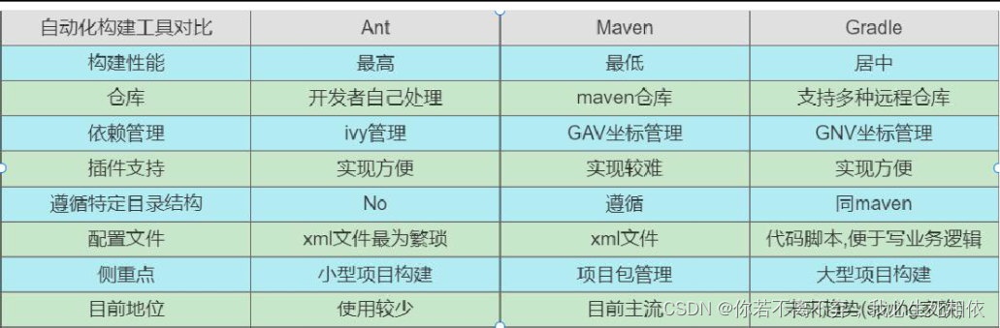
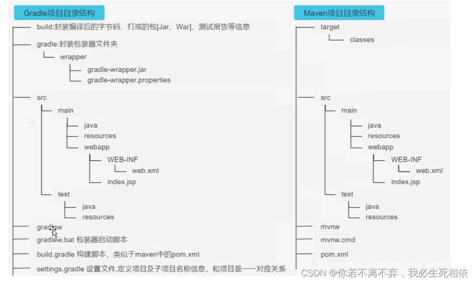
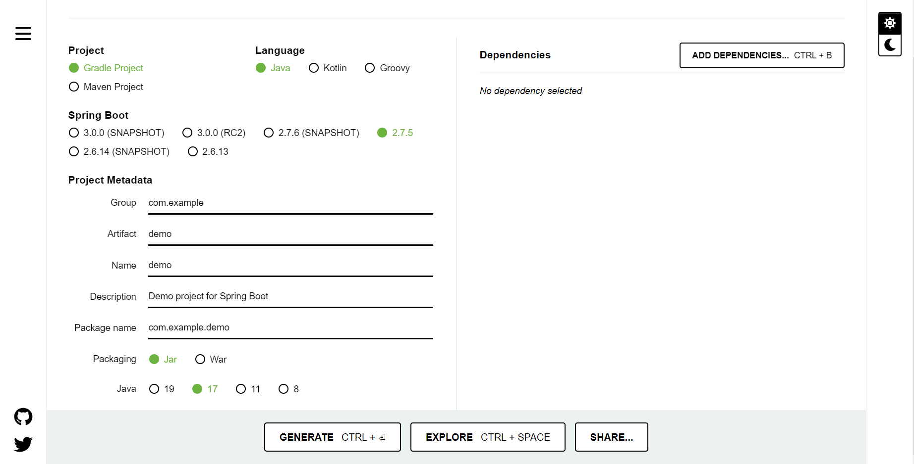
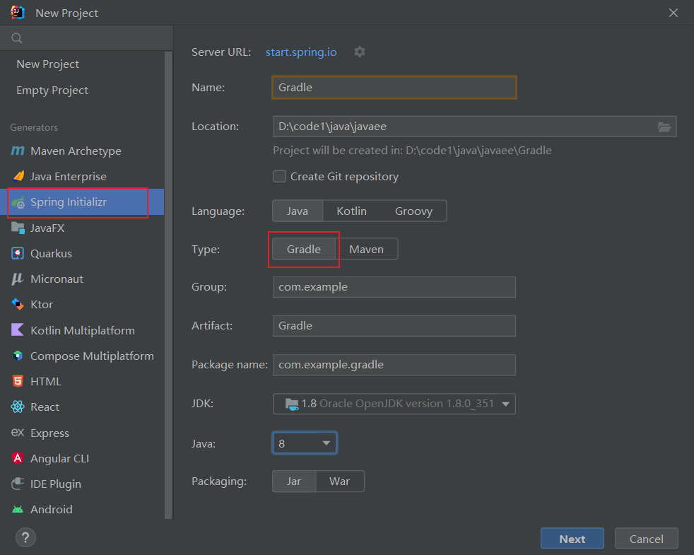
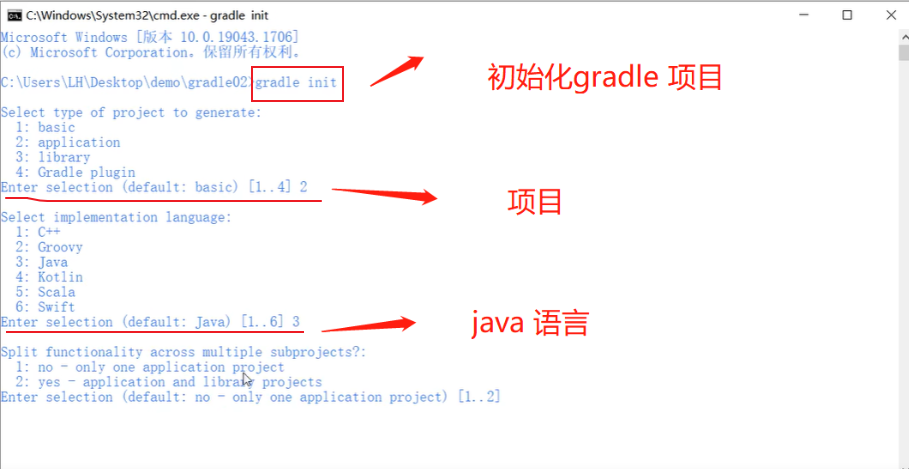
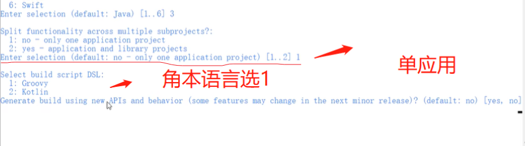
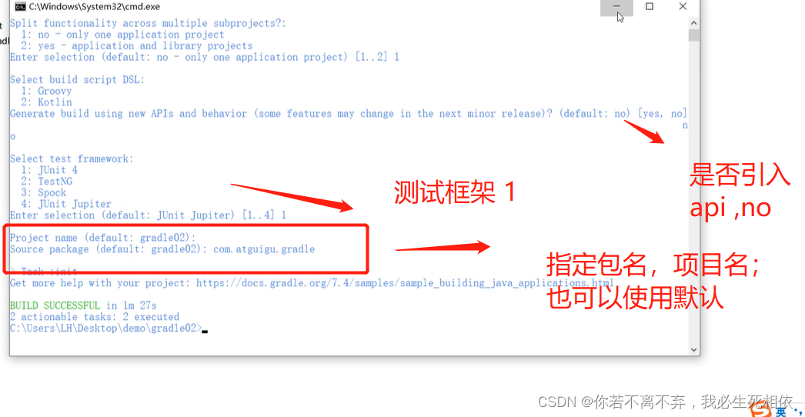
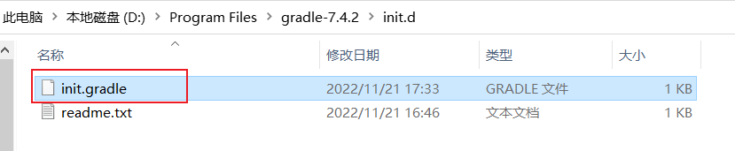

# 一. Gradle介绍

## 1.概述

> Gradle是一款Google推出的 **基于JVM**、 通用灵活的 项目构建工具， 支持[Maven](https://so.csdn.net/so/search?q=Maven&spm=1001.2101.3001.7020)，JCenter多种第三方仓库;支持传递性依赖管理、废弃了繁杂的xml文件，转而使用 **简洁的 、 支持多种语言** (例如：java、[groovy](https://so.csdn.net/so/search?q=groovy&spm=1001.2101.3001.7020)等)的 build脚本文件 。
>
> [官网地址:https://gradle.org/](https://gradle.org/)


## 2.常见的项目构建工具

> Ant: 2000 年Apache推出的纯Java编写构建工具，通过xml[build.xml]文件管理
> 项目优点 ：使用灵活，速度快(快于gradle和maven)，
> 缺点：Ant没有强加任何编码约定的项目目录结构,开发人员需编写繁杂XML文件构建指令,对开发人员是一个挑战。
>
> Maven: (^2004) 年Apache组织推出的再次使用xml文件[pom.xml]管理项目的构建工具。
> 优点:遵循一套约定大于配置的项目目录结构，使用统一的GAV坐标进行依赖管理, 侧重于包管理 。
> 缺点：项目构建过程僵化,配置文件编写不够灵活、不方便自定义组件,构建速度慢于gradle。
>
> Gradle: 2012 年Google推出的基于Groovy语言的全新项目构建工具，集合了Ant和Maven各自的优势。
> 优点：集Ant脚本的灵活性+Maven约定大于配置的项目目录优势,支持多种远程仓库和插件 ,侧重于大项目构建 。
> 缺点：学习成本高、资料少、脚本灵活、版本兼容性差等。
> 


## 3. Gradle优势

> **依赖管理**:即将你项目中的jar包管理起来，你可以使用Maven或者Ivy的远程仓库、或者本地文件系统等
>
>  **编译打包**:可以通过脚本实现花样打包，包括修改文件、添加抑或排除某些类或资源、采用指定JDK版本构建、打包后自动上传等等等等
>
>  **多项目支持**: Gradle对多项目有着良好的支持，比如一个很具有代表性的实践就是spring framework
>
>  **多语言支持**：无论是java、groovy、scala、c++都有良好的支持
>
>  **跨平台支持**：gradle是基于jvm的，只要有jvm你就可以让gradle运行
>
>  **灵活的的脚本**：你可以使用groovy灵活的编写任务完成你想要做的任何事情


## 4. Gradle安装

### 4.1安装说明

> SpringBoot官方文档明确指出,目前SpringBoot的Gradle插件需要gradle 6. 8 版本及以上，所以我们这里选择 7 .x版本。
>
> 其中SpringBoot与Gradle存在版本兼容问题，Gradle与Idea也存在兼容问题，所以考虑到java程序员会使SpringBoot，所以要选择 6. 8 版本及高于 6. 8 版本的Gradle,那么相应的idea版本也要升级,不能太老哦。
>
> 查看本地idea 对应版本；尽量保持统一；现在推荐6.8以上；

### 4.2官网下载

> [Gradle | Releases](https://gradle.org/releases/)

### 4.3配置环境变量

> 创建 `GRADLE_HOME` 系统变量
>
> 把 `%GRADLE_HOME%\bin` 加入Path
>
> ```bash
> gradle -v	# 查看gradle版本
> ```


## 5. Gradle项目结构

> Gradle项目 默认目录结构和Maven项目的目录结构一致 ,都是基于 约定大于配置【ConventionOverConfiguration】。其完整项目目录结构如下所示：(**`重点在build.gradle和settings.gradle`**)
>
> 


## 6. 创建Gradle项目

### 6.1使用在线SpringInitializr

> 网址：https://start.spring.io/
>
> 


### 6.2 idea创建

> 


### 6.3 命令创建

> 
>
> 
>
> 


# 二. Gradle使用

## 1. Gradle常用指令

> | 常用命令             | 作用                       |
> | -------------------- | -------------------------- |
> | gradle clean         | 清空build目录              |
> | gradle classes       | 编译业务代码和配置文件     |
> | gradle test          | 编译测试代码，生成测试报告 |
> | gradle build         | 构建项目                   |
> | gradle build -x text | 跳过测试构建项目           |
>
> 这些命令，要在具有build.gradle的目录执行

## 2. 修改maven下载源

> 我们可以在gradle的init.d目录下创建以.gradle结尾的文件，.gradle文件可以实现在build开始之前执行，所以你可以在这个文件配置一些你想预先加载的操作。
>
> 

> ```
> allprojects {
>     repositories {
>         mavenLocal()
>         maven { name "Alibaba" ; url "https://maven.aliyun.com/repository/public" } 
>         maven { name "Bstek" ; url "https://nexus.bsdn.org/content/groups/public/" } 
>         mavenCentral()
>     }
>     
>     buildscript {
>         repositories {
>             maven { name "Alibaba" ; url 'https://maven.aliyun.com/repository/public' } 
>             maven { name "Bstek" ; url 'https://nexus.bsdn.org/content/groups/public/' } 
>             maven { name "M2" ; url 'https://plugins.gradle.org/m2/' }
>         }
>     }
> }
> ```


## 3.启用我们写的gradle配置文件

1. 在命令行指定文件,例如：**`gradle --init-script yourdir/init.gradle -q taskName`**。你可以多次输入此命令来指定多个init文件

2. 把init.gradle文件放USER_HOME/.gradle/ 目录下

3. 把以.gradle结尾的文件放到 USER_HOME/.gradle/init.d/ 目录下

4. 把以.gradle结尾的文件放到 GRADLE_HOME/init.d/ 目录下


