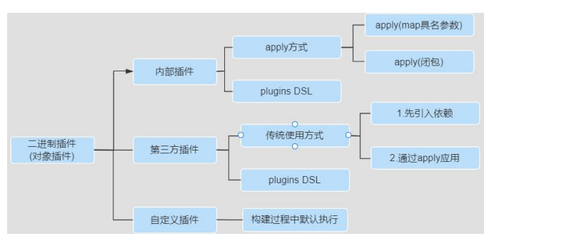

# 一. Gradle介绍

## 1.概述

> Gradle是一款Google推出的 **基于JVM**、 通用灵活的 项目构建工具， 支持[Maven](https://so.csdn.net/so/search?q=Maven&spm=1001.2101.3001.7020)，JCenter多种第三方仓库;支持传递性依赖管理、废弃了繁杂的xml文件，转而使用 **简洁的 、 支持多种语言** (例如：java、[groovy](https://so.csdn.net/so/search?q=groovy&spm=1001.2101.3001.7020)等)的 build脚本文件 。
>
> [官网地址:https://gradle.org/](https://gradle.org/)


## 2.常见的项目构建工具

> Ant: 2000 年Apache推出的纯Java编写构建工具，通过xml[build.xml]文件管理
> 项目优点 ：使用灵活，速度快(快于gradle和maven)，
> 缺点：Ant没有强加任何编码约定的项目目录结构开发人员需编写繁杂XML文件构建指令对开发人员是一个挑战。
>
> Maven: (^2004) 年Apache组织推出的再次使用xml文件[pom.xml]管理项目的构建工具。
> 优点:遵循一套约定大于配置的项目目录结构，使用统一的GAV坐标进行依赖管理 侧重于包管理 。
> 缺点：项目构建过程僵化配置文件编写不够灵活、不方便自定义组件构建速度慢于gradle。
>
> Gradle: 2012 年Google推出的基于Groovy语言的全新项目构建工具，集合了Ant和Maven各自的优势。
> 优点：集Ant脚本的灵活性+Maven约定大于配置的项目目录优势支持多种远程仓库和插件 侧重于大项目构建 。
> 缺点：学习成本高、资料少、脚本灵活、版本兼容性差等。
> 


## 3. Gradle优势

> **依赖管理**:即将你项目中的jar包管理起来，你可以使用Maven或者Ivy的远程仓库、或者本地文件系统等
>
>  **编译打包**:可以通过脚本实现花样打包，包括修改文件、添加抑或排除某些类或资源、采用指定JDK版本构建、打包后自动上传等等等等
>
>  **多项目支持**: Gradle对多项目有着良好的支持，比如一个很具有代表性的实践就是spring framework
>
>  **多语言支持**：无论是java、groovy、scala、c++都有良好的支持
>
>  **跨平台支持**：gradle是基于jvm的，只要有jvm你就可以让gradle运行
>
>  **灵活的的脚本**：你可以使用groovy灵活的编写任务完成你想要做的任何事情


## 4. Gradle安装

### 4.1安装说明

> SpringBoot官方文档明确指出目前SpringBoot的Gradle插件需要gradle 6. 8 版本及以上，所以我们这里选择 7 .x版本。
>
> 其中SpringBoot与Gradle存在版本兼容问题，Gradle与Idea也存在兼容问题，所以考虑到java程序员会使SpringBoot，所以要选择 6. 8 版本及高于 6. 8 版本的Gradle那么相应的idea版本也要升级不能太老哦。
>
> 查看本地idea 对应版本；尽量保持统一；现在推荐6.8以上；

### 4.2官网下载

> [Gradle | Releases](https://gradle.org/releases/)


### 4.3配置环境变量

1.  创建 `GRADLE_HOME` 系统变量

2.  把 `%GRADLE_HOME%\bin` 加入Path

3.  查看是否配置成功

    >  ```bash
    >  gradle -v # 查看gradle版本
    >  ```

4.  这里我们接着再配置一个 **`GRALE_USER_HOME`** 环境变量

> 
>
> **`GRALE_USER_HOME`** 相当于配置 **Gradle 本地仓库位置**和 **Gradle Wrapper 缓存目录**


## 5. Gradle项目结构

> Gradle项目 默认目录结构和Maven项目的目录结构一致 都是基于 约定大于配置【ConventionOverConfiguration】。其完整项目目录结构如下所示：(**`重点在build.gradle和settings.gradle`**)
>
> 


## 6. 创建Gradle项目

### 6.1使用在线SpringInitializr

> 网址：https://start.spring.io/
>
> 


### 6.2 idea创建

> 


### 6.3 命令创建

> 
>
> 
>
> 


# 二. Gradle使用

## 1. Gradle常用指令

> | 常用命令             | 作用                       |
> | -------------------- | -------------------------- |
> | gradle clean         | 清空build目录              |
> | gradle classes       | 编译业务代码和配置文件     |
> | gradle test          | 编译测试代码，生成测试报告 |
> | gradle build         | 构建项目                   |
> | gradle build -x text | 跳过测试构建项目           |
>
> 这些命令，要在具有build.gradle的目录执行

## 2. 修改maven下载源

> 我们可以在gradle的init.d目录下创建以.gradle结尾的文件，.gradle文件可以实现在build开始之前执行，所以你可以在这个文件配置一些你想预先加载的操作。
>
> 

> ```
> allprojects {
>     repositories {
>         mavenLocal()
>         maven { name "Alibaba" ; url "https://maven.aliyun.com/repository/public" } 
>         maven { name "Bstek" ; url "https://nexus.bsdn.org/content/groups/public/" } 
>         mavenCentral()
>     }
>     
>     buildscript {
>         repositories {
>             maven { name "Alibaba" ; url 'https://maven.aliyun.com/repository/public' } 
>             maven { name "Bstek" ; url 'https://nexus.bsdn.org/content/groups/public/' } 
>             maven { name "M2" ; url 'https://plugins.gradle.org/m2/' }
>         }
>     }
> }
> ```


## 3.启用我们写的gradle配置文件

1. 在命令行指定文件例如：**`gradle --init-script yourdir/init.gradle -q taskName`**。你可以多次输入此命令来指定多个init文件
2. 把init.gradle文件放USER_HOME/.gradle/ 目录下
3. 把以.gradle结尾的文件放到 USER_HOME/.gradle/init.d/ 目录下
4. 把以.gradle结尾的文件放到 GRADLE_HOME/init.d/ 目录下

*  注意

   >  如果存在上面的4种方式的2种以上，gradle会按上面的1-4序号依次执行这些文件，如果给定目录下存在多个init脚本，会按拼音a-z顺序执行这些脚本，每个init脚本都存在一个对应的gradle实例你在这个文件中调用的所有方法和属性，都会委托给这个gradle实例，每个init脚本都实现了Script接口。


## 4. 仓库地址说明

### 4.1 mavenLocal()

>  指定使用本地maven仓库，通常本地maven仓库都会通过settings.xml指定，所以gradle查找jar包的顺序如下：
>
>  `USER_HOME/.m2/settings.xml` 指定的本地仓库  -》 `M2_HOME/conf/settings.xml`指定的maven仓库  -》 `USER_HOME/.m2/repository`。

### 4.2 maven{ url }

>  指定使用maven仓库，一般用于私有仓库或其他第三方库（如阿里镜像仓库地址）

### 4.3 mavenCentral()

>  指定使用中央仓库

### 4.4 注意

>   gradle可以通过指定仓库地址为本地maven仓库地址和远程仓库地址相结合的方式，避免每次都会去远程仓库下载依赖库。这种方式也有一定的问题，如果本地maven仓库有这个依赖，就会从直接加载本地依赖，如果本地仓库没有该依赖，那么还是会从远程下载。但是**下载的jar不是存储在本地maven仓库**中，而是**放在自己的缓存目录**中，默认在 **`USER_HOME/.gradle/caches`** 目录当然如果我们配置过 **`GRADLE_USER_HOME`** 环境变量，则会放在 **`GRADLE_USER_HOME/caches`** 目录，且**不可以将gradle caches指向maven repository**。因为caches下载文件不是按照maven仓库中存放的方式。


## 5. Gradle Wrapper

### 5.1 什么是Gradle Wrapper

>  Gradle Wrapper 实际上就是对 Gradle 的一层包装，用于解决实际开发中可能会遇到的不同的项目需要不同版本的 Gradle 问题。例如：把自己的代码共享给其他人使用，可能出现如下情况:
>
>  1.  对方电脑没有安装 gradle 
>
>  2.  对方电脑安装过 gradle，但是版本太旧了
>
>  这时候，我们就可以考虑使用 Gradle Wrapper 了。这也是官方建议使用 Gradle Wrapper 的原因。**<u>实际上有了 Gradle Wrapper 之后，我们本地是可以不配置 Gradle 的</u>**下载 Gradle 项目后，使用 gradle 项目自带的 wrapper 操作也是可以的。


### 5.2 如何使用 Gradle Wrapper

>  项目中的 `gradlew`（用于linux）、`gradlew.bat`（用于windows） 脚本用的就是wrapper中规定的gradle版本。
>
>  
>
>  
>
>  而我们上面提到的 `gradle` 指令用的是本地 `gradle`，所以 `gradle` 指令和 `gradlew` 指令所使用的gradle版本有可能是不一样的。gradlew、gradlew.cmd的使用方式与gradle使用方式完全一致，只不过把gradle指令换成了gradlew指令


### 5.3 gradlew指令常用参数

>  当然我们也可在终端执行 gradlew 指令时，指定指定一些参数来控制 Wrapper 的生成，比如依赖的版本等
>
>  ```bash
>  gradle wrapper --gradle-version=4.4 
>  # 升级wrapper版本号只是修改gradle.properties中wrapper版本，未实际下载
>  
>  gradle wrapper --gradle-version 5.2.1 --distribution-type all
>  # 关联源码用
>  ```


### 5.4 Gradle Wrapper的执行流程

1.  当我们第一次执行 ./gradlew build 命令的时候，gradlew 会读取 gradle-wrapper.properties 文件的配置信息

2.  准确的将指定版本的 gradle 下载并解压到指定的位置(`GRADLE_USER_HOME`目录下的`wrapper/dists`目录中) 

3.  构建本地缓存(`GRADLE_USER_HOME`目录下的`caches`目录中)下载再使用相同版本的 gradle 就不用下载了

4.  之后执行的 ./gradlew 所有命令都是使用指定的 gradle 版本。


### 5.5 gradle-wrapper.properties文件

>  

>  | 字段名           | 作用                                               |
>  | ---------------- | -------------------------------------------------- |
>  | distributionBase | 下载的Gradle压缩包解压后存储的主目录               |
>  | distributionPath | 相对于distributionBase的解压后的Gradle压缩包的路径 |
>  | distributionUrl  | Gradle发行版压缩包的下载地址                       |
>  | zipStoreBase     | 下载的Gradle压缩包存放位置                         |
>  | zipStorePath     | 相对于zipStoreBase的Gradle压缩包的路径             |

>  **注意**：前面提到的 **`GRALE_USER_HOME`** 环境变量用于 `Gradle Wrapper` 下载的特定版本的 gradle 存储目录。如果我们没有配置过 **`GRALE_USER_HOME`** 环境变量，**默认在当前用户家目录下的.gradle 文件夹**中。


# 三. Gradle与Idea

## 1. Groovy简介

>  在某种程度上，Groovy 可以被视为 Java 的一种脚本化改良版，Groovy 也是运行在 JVM 上，它可以很好地与 Java 代码及其相关库进行交互操作。它是一种成熟的面向对象编程语言，既可以面向对象编程，又可以用作纯粹的脚本语言。大多数有效的 Java 代码也可以转换为有效的 Groovy 代码，Groovy 和 Java 语言的主要区别是：完成同样的任务所需的Groovy 代码比 Java 代码更少。

*  **特点**

   >  1.  提供了动态类型转换、闭包、元编程等
   >  2.  支持函数式编程，不需要main函数
   >  3.  默认导入常用的包
   >  4.  类不支持default作用域，且默认作用域为public
   >  5.  Groovy中基本类型也是对象，可以直接调用对象的方法
   >  6.  支持 DSL（Domain Specific Languages 领域特定语言）和其它简洁的语法，让代码变得易于阅读和维护
   >  7.  Groovy 是基于 Java 语言的，所以完全兼容 Java 语法所以对于 java 程序员学习成本较低

*  官网

   >  http://www.groovy-lang.org/documentation.html


## 2. Groovy安装

>  下载地址：https://groovy.apache.org/download.html

*  **解压并配置环境变量**

   >  


## 3.创建Groovy项目


## 4. Groovy基本语法


## 5. Idea创建Gradle管理的项目

### 5.1第一步：创建由 Gradle 管理的项目

>  


### 5.2第二步：修改当前项目使用本地安装的 gradle

>  可以加快下载项目依赖 jar 包的速度【配置了私服地址】
>
>  


### 5.3注意

1.  在 Terminal 中执行以 gradlew 开头命令和操作图形化的 IDEA 使用 Gradle 版本不一定是同一个版本。

    *  Terminal中以 gradlew 开头指令用的是 Wrapper 规定的 gradle 版本，wrapper 中规定版本默认和idea插件中规定的版本一致。

    *  IDEA使用Gradle是本地安装的

2.  目前只能是在创建项目时重新设置本地 gradle，创建新项目时需要重新去改

3.  当我们在 build.gradle 文件添加依赖之后 ，  这些依赖在下载到 `GRADLE_USER_HOME/caches/modules-2/files-2.1`目录下面所以这里的 `GRADLE_USER_HOME` 相当于 Gradle 的本地仓库，当然也可以如下方式找到 jar 包位置。

    >  


## 6.项目部署

### 6.1概述

> 对于一个 gradle 管理的项目，当我们将一个项目打包成 war 包之后，我们就需要将其部署至服务器上运行，这里有两种方式：
>
> 1. 将项目打包成 war 包，部署到 tomcat 服务器
> 2. 使用 Gretty 插件中内置服务器的方式部署项目

### 6.2将项目部署至tomcat

### 6.3 Gretty部署项目

> Gretty 是一个功能丰富的 gradle 插件，用于在嵌入的 servlet 容器上运行 web 应用程序让项目开发和部署更加简单。目前 Gretty 插件已经作为 gradle 的核心库使用了Gretty 其核心功能为：
>
> 1. 底层支持 jettytomcat 等 Servlet 容器
>
> 2. 支持项目热部署、HTTPS、调试

1. 引入gretty插件

   > ```
   > plugins{
   > 	id 'war'
   > 	id 'org.gretty' version '2.2.0'
   > }
   > ```

2. 指定使用maven仓库

   > ```
   > repositories{
   > 	jcenter()
   > 	mavenCentral()
   > }
   > ```

3. 针对gretty插件的设置

   > ```
   > gretty {
   >     httpPort = 8888
   >     contextPath = "/web"
   >     debugPort = 5005 // default
   >     debugSuspend = true // default
   >     httpsEnabled = true managedClassReload=true //修改了类之后重新加载
   >     //servletContainer = 'tomcat8' //如果不指定默认的servlet容器，支持tomcat7/8，默认是使用的是Jetty服务器
   >     httpsPort = 4431
   > }
   > ```

4. 执行gretty插件

   > ```bash
   > gradle appRun
   > ```


## 7. Gradle对测试的支持

### 7.1 默认测试目录以及标准输出

> 


### 7.2 junit的使用

1.  **junit4**

   > ```
   > dependencies{
   > 	testImplementation group:'junit' name:'junit' version:'4.12'
   > }
   > test{
   > 	useJUnit()
   > }
   > ```

2.  **junit5**

   > ```
   > dependencies {
   > 	testImplementation 'org.junit.jupiter:junit-jupiter-api:5.8.1' 
   > 	testRuntimeOnly 'org.junit.jupiter:junit-jupiter-engine:5.8.1' 	
   > }
   > test {
   > 	useJUnitPlatform()
   > }
   > ```

* 注意

   > 无论是 Junt4.x 版本还是 Junit5.x 版本，我们只需在 build.gradle 目录下执行 gradle test 指令，gradle 就会帮我们执行所有的加了@Test 注解的测试，并生成测试报告


### 7.3 包含和排除测试

> ```
> test {
> 	enabled true 
> 	useJUnit()
> 	include 'com/**' 
> 	exclude 'com/abc/**' 
> }
> ```


# 四. Gradle进阶


## 1.项目的生命周期

> Gradle 项目的生命周期分为三大阶段: Initialization -> Configuration -> Execution. 每个阶段都有自己的职责具体如下图所示:
>
> 


### 1.1 Initialization

> **Initialization** **阶段**主要目的是初始化构建 它又分为两个子过程一个是执行 **Init Script**另一个是执行 **Setting Script**。
>
> **init.gradle** 文件会在每个项目 build 之前被调用，用于做一些初始化的操作，它主要有如下作用：
>
> 1. 配置内部的仓库信息（如公司的 maven 仓库信息）；
>
> 2. 配置一些全局属性；
>
> 3. 配置用户名及密码信息（如公司仓库的用户名和密码信息）
>
> **Setting Script** 则更重要 它初始化了一次构建所参与的所有模块。


### 1.2 Configuration

> 
>
> **Configuration** **阶段**：这个阶段开始加载项目中所有模块的 Build Script。所谓 "加载" 就是执行 build.gradle 中的语句 
>
> 根据脚本代码创建对应的 task 最终根据所有 task 生成由 **Task** **组成的有向无环图**(Directed Acyclic Graphs)，如下:
>
> 
>
> 从而构成如下**有向无环树**：
>
> 


### 1.3 Execution

> 这个阶段会根据上个阶段构建好的有向无环图，按着顺序执行 Task【Action 动作】


## 2. settings文件

### 2.1 概述

> **作用**：主要是在项目初始化阶段确定一下引入哪些工程需要加入到项目构建中为构建项目工程树做准备。
>
> **内容**：里面主要定义了当前 gradle 项目及子 project 的项目名称
>
> **位置**：必须放在根工程目录下。（子工程也可以有 `settings.gradle` 文件）
>
> **名字**：为 settings.gradle 文件，不能发生变化
>
> **项目名称中 ":" 代表项目的分隔符 类似路径中的 "/". 如果以 ":" 开头则表示相对于 root project 。然后 Gradle 会为每个带有 build.gradle 脚本文件的工程构建一个与之对应的 Project 对象**
>
> 一个子工程只有在 setting 文件中配置了才会被 gradle 识别这样在构建的时候才会被包含进去


### 2.2示例

> ```
> //根工程项目名
> rootProject.name = 'root' 
> 
> //包含的子工程名称
> include 'subject01' 
> include 'subject02' 
> include 'subject03' 
> 
> //包含的子工程下的子工程名称
> include 'subject01:subproject011' 
> include 'subject01:subproject012'
> ```


## 3. Task

### 3.1任务概述


## 4. Gradle中的文件操作

### 4.1几种常见的文件操作方式

> 本地文件、文件集合、文件树、文件拷贝、归档文件

### 4.2 本地文件

### 4.3文件集合

### 4.4文件树

### 4.5文件拷贝

### 4.6归档文件


## :five: Dependencies

### 1.依赖的方式

> Gradle中的依赖有 **直接依赖**、**项目依赖**、**本地jar依赖**

* 示例

   > ```
   > dependencies {
   > 	// 1.依赖当前项目下的某个模块[子工程]（项目依赖）
   > 	implementation project(':subject01')
   > 	
   > 	// 2.直接依赖本地的某个jar文件
   > 	implementation files('libs/foo.jar' 'libs/bar.jar')
   > 	// 2.配置某文件夹作为依赖项
   > 	implementation fileTree(dir: 'libs' include: ['*.jar'])
   > 	
   > 	// 3.直接依赖
   > 	implementation 'org.apache.logging.log4j:log4j:2.17.2' 
   > 	// 另一种写法：
   > 	//implementation group:'org.apache.logging.log4j' name:'log4j' version:'2.17.2'
   > }
   > ```

#### 1.1直接依赖

> 在项目中直接导入的依赖，就是直接依赖
>
> **`implementation 'org.apache.logging.log4j:log4j:2.17.2'`** 
>
> 上面是简写法，完整版写法如下：
>
> **`implementation group:'org.apache.logging.log4j' name:'log4j' version:'2.17.2'`**


* implementation 类似 maven 中的依赖的 scope对比 maven 中的依赖: 

> ```xml
> <dependency>
>     <groupId>log4j</groupId>
>     <artifactId>log4j</artifactId>
>     <version>1.2.12</version>
>     <scope>compile</scope>
> </dependency>
> ```


#### 1.2项目依赖

> 本项目中的一个模块依赖另一个模块
>
> **`implementation project(':subject01')`**
>
> 这种依赖方式是直接依赖本工程中的 libary module，这个 libary module 需要在 setting.gradle 中配置。
>
> **`include 'subject01'`**


#### 1.3本地jar依赖

> 本地 jar 文件依赖，一般包含以下两种方式
>
> ```
> //直接依赖某文件
> implementation files('libs/foo.jar' 'libs/bar.jar')
> 
> //配置某文件夹作为依赖项
> implementation fileTree(dir: 'libs' include: ['*.jar'])
> ```

### 2.依赖的类型

> **类似于 Maven 的 scope 标签，gradle 也提供了依赖的类型**，具体如下所示:
>
> |                    |                                                              |
> | ------------------ | ------------------------------------------------------------ |
> | compileOnly        | 由 java 插件提供，适用于编译期需要而不需要打包的依赖         |
> | runtimeOnly        | 由 java 插件提供，只在运行期有效，编译时不需要。如 mysql 驱动包 |
> | implementation     | 由 java 插件提供，针对源码[src/main 目录] ，在编译、运行时都有效 |
> | testCompileOnly    | 由 java 插件提供，用于编译测试的依赖项，运行时不需要         |
> | testRuntimeOnly    | 由 java 插件提供，只在测试运行时需要，而不是在测试编译时需要 |
> | testImplementation | 由 java 插件提供，针对测试代码[src/test 目录]                |
> | providedCompile    | war 插件提供支持，编译、测试阶段代码需要依赖此类 jar 包，而运行阶段容器已经提供了相应的支持，所以无需将这些文件打入到 war 包中了；例如 servlet-api.jar、jsp-api.jar |
> | compile            |                                                              |
> | runtime            |                                                              |
> | api                | java-library 插件提供支持，这些依赖项可以传递性地导出给使用者，用于编译时和运行时 |
> | compileOnlyApi     | java-library 插件提供支持，在声明模块和使用者在编译时需要的依赖项，但在运行时不需要 |
>
> **java 插件提供的功能，java-library 插件都提供**


* **官方参考文档**

   > https://docs.gradle.org/current/userguide/java_library_plugin.html#java_library_plugin: 各个依赖范围的关系和说明
   >
   > 
   >
   > https://docs.gradle.org/current/userguide/upgrading_version_6.html#sec:configuration_removal : 依赖范围升级和移除
   >
   > 
   >
   > https://docs.gradle.org/current/userguide/java_library_plugin.html#java_library_plugin：API 和 implemention 区别
   >
   > 
   >
   > https://docs.gradle.org/current/userguide/java_plugin.html#java_plugin: 执行 java 命令时都使用了哪些依赖范围的依赖。


### 3. api 与 implementation 区别

#### 5.3.1概述

> |          |                            api                             |                        implementation                        |
> | -------- | :--------------------------------------------------------: | :----------------------------------------------------------: |
> | 编译时   | 能进行依赖传递，底层模块变，依赖该模块的都要变，编译速度慢 | 不能进行传递依赖，底层模块变，依赖该模块的不用变，编译速度快 |
> | 运行时   |          运行时会加载，所有模块的class都要被加载           |           运行时会加载，所有模块的class都要被加载            |
> | 应用场景 |             适用于多模块依赖，避免重复依赖模块             |               多数情况下都是使用implementation               |

#### 5.3.2举例分析

> 
>
> **编译时**: 如果 **libC** 的内容发生变化，由于使用的是 api 依赖，依赖会传递，所以 libC、libA、projectX 都要发生变化，都需要重新编译，速度慢
>
> **运行时：**libC、libA、projectX 中的 class 都要被加载。
>
> 
>
> **编译时:** 如果 **libD** 的内容发生变化，由于使用的是 implemetation 依赖，依赖不会传递，只有 libD、libB 要变化并重新编译，速度快
>
> **运行时：**libD、libB、projectX 中的 class 都要被加载。


#### 5.3.3案例分析

> api 的适用场景是多 module 依赖，moduleA 工程依赖了 module B，同时 module B 又需要依赖了 module C，modelA 工程也需要去依赖 module C，这个时候避免重复依赖 module，可以使用 module B api 依赖的方式去依赖 module C，modelA 工程只需要依赖 moduleB 即可。
>
> 

> **总之，除非涉及到多模块依赖，为了避免重复依赖，咱们会使用** **api,**其它情况我们优先选择 **implementation**，拥有大量的 api 依赖项会显著增加构建时间。


### 4.依赖冲突及解决方案

#### 5.4.1依赖冲突

> 依赖冲突是指 "在编译过程中，如果存在某个依赖的多个版本，构建系统应该选择哪个进行构建的问题"，如下所示:
>
> 
>
> A、B、C 都是本地子项目 module，log4j 是远程依赖。
>
> **编译时：** B 用 1.4.2 版本的 log4j，C 用 2.2.4 版本的 log4j,B 和 C 之间没有冲突
>
> **打包时：** 只能有一个版本的代码最终打包进最终的A对应的jar |war包，对于 Gradle 来说这里就有冲突了


#### 5.4.2 解决方法

##### 1. gradle默认使用最新的版本

> 默认情况下，Gradle 会使用最新版本的 jar 包【考虑到新版本的 jar 包一般都是向下兼容的】，实际开发中，还是建议使用官方自带的这种解决方案。

##### 2. Exclude 排除某个依赖

> ```
> dependencies {
> 	testImplementation 'org.junit.jupiter:junit-jupiter-api:5.8.1' 
> 	testRuntimeOnly 'org.junit.jupiter:junit-jupiter-engine:5.8.1' 
> 	implementation('org.hibernate:hibernate-core:3.6.3.Final'){
> 		//排除某一个库(slf4j)依赖:如下三种写法都行
> 		exclude group: 'org.slf4j' 
> 		exclude module: 'slf4j-api' 
> 		exclude group: 'org.slf4j',module: 'slf4j-api' 
> 	}
> 	//排除之后,使用手动的引入即可。
>     implementation 'org.slf4j:slf4j-api:1.4.0' 
> }
> ```

##### 3.不允许依赖传递

> ```
> dependencies {
> 	testImplementation 'org.junit.jupiter:junit-jupiter-api:5.8.1' 
> 	testRuntimeOnly 'org.junit.jupiter:junit-jupiter-engine:5.8.1' 
> 	implementation('org.hibernate:hibernate-core:3.6.3.Final'){
>         //不允许依赖传递，一般不用
>         transitive(false)
>     }
>     //排除之后,使用手动的引入即可
>     implementation 'org.slf4j:slf4j-api:1.4.0' 
> }
> ```
>
> 在添加依赖项时,如果设置 transitive 为 false,表示关闭依赖传递。即**内部的所有依赖将不会添加到编译和运行时的类路径**。

##### 4.强制使用某个版本

> ```
> dependencies {
> 	testImplementation 'org.junit.jupiter:junit-jupiter-api:5.8.1' 
> 	testRuntimeOnly 'org.junit.jupiter:junit-jupiter-engine:5.8.1' 
> 	implementation('org.hibernate:hibernate-core:3.6.3.Final')
>         //强制使用某个版本!!【官方建议使用这种方式】
>         implementation('org.slf4j:slf4j-api:1.4.0!!')
>         //这种效果和上面那种一样,强制指定某个版本
>         implementation('org.slf4j:slf4j-api:1.4.0'){ version{
>         	strictly("1.4.0")
> 		}
> 	}
> }
> ```


#### 5.4.3扩展

> **我们可以先查看当前项目中到底有哪些依赖冲突**
>
> 在 build.gradle 文件中加入下列代码：
>
> ```
> //下面我们配置，当 Gradle 构建遇到依赖冲突时，就立即构建失败(停止构建)
> configurations.all() {
>     Configuration configuration ->
>     //当遇到版本冲突时直接构建失败
>     configuration.resolutionStrategy.failOnVersionConflict()
> }
> ```


## :six: Gradle插件

### 6.1为什么使用插件

> 1. 促进代码重用、减少功能类似代码编写、提升工作效率
>
> 2. 促进项目更高程度的模块化、自动化、便捷化
>
> 3. 可插拔式的的扩展项目的功能

### 6.2插件作用

> 1. 可以添加任务【task】到项目中，从而帮助完成测试、编译、打包等。
>
> 2. 可以添加依赖配置到项目中。
>
> 3. 可以向项目中拓展新的扩展属性、方法等。
>
> 4. 可以对项目进行一些约定，如应用 Java 插件后，约定 src/main/java 目录是我们的源代码存在位置，编译时编译这个目录下的 Java 源代码文件。

### 6.3插件的分类和使用

#### :one: 脚本插件

> 脚本插件的本质就是一个脚本文件，使用脚本插件时通过 **`apply from:`** 将脚本加载进来就可以了。（的脚本文件可以是本地的也可以是网络上的脚本文件）
>
> **意义：**脚本文件时模块化的基础，可按功能把我们的脚本进行拆分一个个公用、职责分明的文件，然后在主脚本文件引用，比如：将很多共有的库版本号一起管理、应用构建版本一起管理等。

* 脚本插件（文件名为 version.gradle）

   > ```
   > ext {
   > 	company= "尚硅谷" 
   > 	cfgs = [
   >     	compileSdkVersion : JavaVersion.VERSION_1_8
   >     ]
   >     spring = [
   >     	version : '5.0.0' 
   >     ]
   > }
   > ```

* 在 build.gradle 中引入脚本插件

   > ```
   > apply from:'version.gradle'
   > task taskVersion{
   > 	doLast{
   > 		println "公司名称为：${company},JDK版本是${cfgs.compileSdkVersion},版本号是${spring.version}" 
   > 	}
   > }
   > dependencies{
   > 	//...
   > }
   > ```

* 执行任务

   > ```bash
   > gradle -q taskVersion # 在命令行中执行该命令
   > ```


#### :two: 对象插件之内部插件(核心插件)

> Gradle 中提供的二进制插件【核心插件】,可参考: https://docs.gradle.org/current/userguide/plugin_reference.html

> 二进制插件(对象插件)就是实现了 `org.gradle.api.Plugin` 接口的插件，每个 Java Gradle 插件都有一个 plugin id。
>
> 

* 使用插件，以Java插件为例（在 build.gradle 中声明）

   > ```
   > apply plugin:'java' // 方式1：map具名参数方式，指定插件id
   > 
   > // 方式2：使用闭包作为project.apply方法的一个参数
   > apply {
   > 	plugin 'java'
   > }
   > 
   > apply plugin:org.gradle.api.plugins.JavaPlugin // 方式3：Map具名参数，指定插件全类名
   > ```
   >
   > 通过上述代码就将 Java 插件应用到我们的项目中了，对于 Gradle 自带的核心插件都有唯一的 plugin id，其中 java 是 Java 插件的 plugin id,这个 plugin id 必须是唯一的，可使用应用包名来保证 plugin id 的唯一性。这里的 java 对应的具体类型是 `org.gradle.api.plugins.JavaPlugin`。


#### :three: 对象插件之第三方插件

> 如果是使用第三方发布的二进制插件，一般需要配置对应的仓库和类路径
>
> (也就是社区插件，需要事先引入，不必写版本号)


##### 1. 传统应用方式

> ```
> // 1. 先引入插件
> buildscript { 
>     ext {
>         springBootVersion = "2.3.3.RELEASE"
>     }
>     repositories { 
>         mavenLocal() 
>         maven { url 'http://maven.aliyun.com/nexus/content/groups/public' }
>         jcenter()
>     }
>     // 此处先引入插件
>     dependencies { 
>         classpath("org.springframework.boot:spring-boot-gradle-plugin:${springBootVersion}")
>     }
> }
> 
> // 2. 再应用插件
> apply plugin: 'org.springframework.boot'
> ```


##### 2. plugins DSL

> 第三方插件已经被托管在 https://plugins.gradle.org/ 网站上，就可以不用在 buildscript 里配置 classpath 依赖了，直接使用新出的 plugins DSL 的方式引用

> ```
> // 1. 引入插件
> plugins {
> 	id 'org.springframework.boot' version '2.4.1' 
> }
> 
> // 2. 再应用插件
> apply plugin: 'org.springframework.boot'
> ```

##### 3. 两种应用方式注意点

> 1. .如果使用老式插件方式 buildscript{}要放在 build.gradle 文件的最前面,而新式 plugins{}没有该限制
> 2. 托管在 gradle 插件官网的第三方插件有两种使用方式，一是传统的 buildscript 方式，一种是 plugins DSL 方式


#### :four:对象插件之用户自定义插件


### 6.4 buildSrc项目


### 6.5插件的关注点


### 6.6 Java 插件分析


## 7. build.gradle文件

### 7.1概述

> build.gradle 是一个 gradle 的构建脚本文件,支持 java、groovy 等语言。
>
> 每个 project 都会有一个 build.gradle 文件,该文件是项目构建的入口,可配置版本、插件、依赖库等信息。
>
> 每个 build 文件都有一个对应的 Project 实例,对 build.gradle 文件配置，本质就是设置 Project 实例的属性和方法。
>
> 由于每个 project 都会有一个 build 文件,那么 Root Project 也不列外.Root Project 可以获取到所有 Child Project,所以在Root Project 的 build 文件中我们可以对 Child Project 统一配置,比如应用的插件、依赖的 maven 中心仓库等。
>
> build 文件中常见的属性和方法如下所示：
>
> 


### 7.2 常见属性

> ```
> // 指定使用什么版本的jdk编译源代码，跟编译环境有关，在有java插件时才能使用
> sourceCompatibility = 1.8
> 
> // 指定生成特定于某个jdk版本的class文件，和运行环境有关，在有java插件时才能使用
> targetCompatibility = 1.8
> 
> // 业务编码字符集，注意这是指定源码解码的字符集[编译器]
> compileJava.options.encoding"UTF-8"
> 
> // 测试编码字符集，注意这是指定源码解码的字符集[编译器]
> compileTestJava.options.encoding"UTF-8"
> 
> //编译JAVA文件时采用UTF-8:注意这是指定源码编码的字符集【源文件】
> tasks.withType(JavaCompile){
> 	options.encoding="UTF-8"
> }
> 
> //编译JAVA文件时采用UTF-8:注意这是指定文档编码的字符集【源文件】
> tasks.withType(Javadoc){
> 	options.encoding="UTF-8"
> }
> ```


### 7.3 repositories

> gradle会按着仓库配置的顺序，从上往下依次去对应的仓库中找所需要的jar包，如果找到，则停止向下搜索，如果找不到，继续在下面的仓库中查找。

> ```
> repositories {
> 	//指定去本地某个磁盘目录中查找:使用本地file文件协议:一般不用这种方式
> 	maven { url 'file:///D:/repos/mavenrepos3.5.4'} 
> 	maven { url "$rootDir/lib/release" }
> 	
>     //指定去maven的本地仓库查找
>     mavenLocal()
>     
>     //指定去maven的私服或者第三方镜像仓库查找
>     maven { name "Alibaba" ; url "https://maven.aliyun.com/repository/public" } 
> 	maven { name "Bstek" ; url "https://nexus.bsdn.org/content/groups/public/" }
> 	
>     //指定去maven的远程仓库查找:即 https://repo.maven.apache.org/maven2/ 
>     mavenCentral()
>     
>     //去google仓库查找
>     google()
> }
> ```
>
> 

### 7.4 allprojects

> allprojects 中的配置是对所有 project（包括 Root Project 和 Child Project）进行统一配置。
>
> ```
> allprojects{
> 	group 'com.gradle'
> 	version '1.0.0'
> 	
> 	apply plugin: 'org.springframework.boot'
> 	apply plugin: 'io.spring.dependency-management'
> 	apply plugin: 'java'
>     apply plugin: 'java-library'
>     
>     sourceCompatibility = '8'
>     
>     repositories {
>         mavenLocal()  
>         maven {
>             url 'https://maven.aliyun.com/nexus/content/groups/public/'
>         }
>         maven {
>             url 'https://maven.aliyun.com/nexus/content/repositories/jcenter'
>         }
>         mavenCentral()
>     }
>     
>     dependencies{
>     	// ...
>     }
>     
>     test {
>         useJUnitPlatform()
>     }
> }
> 
> plugins {
>     id 'org.springframework.boot' version '2.5.2'
>     id 'io.spring.dependency-management' version '1.0.11.RELEASE'
>     id 'java'
>     id 'java-library'
> }
> ```


### 7.5 subprojects

> subprojects 是对所有 Child Project 进行统一配置。

* 拓展

   > 1. 如果是直接在根 project 配置 repositories 和 dependencies 则只对根工程有效（不被 allprojects、subprojects 包裹）
   >
   > 2. 我们也可以在对单个 Project 进行单独配置：(一般不会这样用，而是给子工程也创建一个build.gradle文件)
   >
   >    ```
   >    project('subject01'){
   >    	repositories{// ...}
   >    	dependencies{// ...}
   >    }
   >    ```


### 7.6 ext 用户自定义属性

> Project 和 Task 都允许用户添加额外的自定义属性，要添加额外的属性，通过应用所属对象的 ext 属性即可实现。添加之后可以通过 ext 属性对自定义属性读取和设置，如果要同时添加多个自定义属性,可以通过 ext 代码块:
>
> ```
> // 自定义一个 Project 的属性
> ext.age=18
> // 一次性定义多个属性
> ext{
> 	name='lwb'
> 	sex='male'
> }
> ```


### 7.7 buildscript

> buildscript 里是 gradle 脚本执行所需依赖。(也就是说buildscrpit是用来引入第三方插件的)
>
> ```
> // 1. 先引入插件
> buildscript { 
>     ext {
>         springBootVersion = "2.3.3.RELEASE"
>     }
>     repositories { 
>         mavenLocal() 
>         maven { url 'http://maven.aliyun.com/nexus/content/groups/public' }
>         jcenter()
>     }
>     // 此处先引入插件
>     dependencies { 
>         classpath("org.springframework.boot:spring-boot-gradle-plugin:${springBootVersion}")
>     }
> }
> 
> // 2. 再应用插件
> apply plugin: 'org.springframework.boot'
> ```
>
> 

* **注意**

   > 1. buildscript{}必须在 build.gradle 文件的最前端。
   >
   > 2. 对于多项目构建，项目的 buildscript ()方法声明的依赖关系可用于其所有子项目的构建脚本。
   >
   > 3. 构建脚本依赖可能是 Gradle 插件。


## 8. gradle.properties

> gradle.properties 文件案例：加快构建速度的，gradle.properties 文件中的属性会自动在项目运行时加载。
>
> ```properties
> ## 设置此参数主要是编译下载包会占用大量的内存，可能会内存溢出
> org.gradle.jvmargs=-Xms4096m -Xmx8192m
> 
> ## 开启gradle缓存
> org.gradle.caching=true 
> 
> #开启并行编译
> org.gradle.parallel=true 
> 
> #启用新的孵化模式
> org.gradle.configureondemand=true 
> 
> #开启守护进程
> org.gradle.daemon=true
> ```
>
> 详细请参考：https://docs.gradle.org/current/userguide/build_environment.html#sec:gradle_configuration_properties


## :nine:publishing项目发布

### 1.概述

> 接下来,将咱们写好的模块发布发布到公司的私服以供别人使用
>
> 

### 2. 第一步：引入maven发布的插件

> 在 build.gradle 添加如下代码：
>
> ```
> plugins{
> 	id'java-library'
> 	id'maven-publish'
> }
> ```

### 3.第二步：设置发布代码

> 在 build.gradle 添加如下代码：
>
> ```
> publishing {
>     publications {
>         myLibrary(MavenPublication) {
>             groupId = 'org.gradle.sample'
>             artifacts = 'library'
>             version = '1.0'
>             from components.java // 发布 jar 包
>             // from components.web // 发布war包（要引入war插件
>         }
>     }
>     repositories {
>         mavenLocal() // 发布到本地maven仓库
> 
>         // 发布项目到私服中
>         maven {
>             // name属性可选,表示仓库名称
>             name = 'myRepo'
> 
>             //发布地址:可以是本地仓库或者maven私服
>             url = 'https://maven.aliyun.com/nexus/content/groups/public/'
>         }
>         //认证信息:用户名和密码
>         credentials {
>             username = 'joe'
>             password = 'secret'
>         }
>     }
> }
> ```


### 4.第三步：执行发布命令

> 执行发布命令，将项目发布到本地仓库或者远程仓库。常见的发布指令有：
>
> **`generatePomFileForPubNamePublication`**: 生成 pom 文件
>
> **`publishPubNamePublicationToRepoNameRepository`**:发布项目到指定仓库,如果没有仓库名，默认为 maven
>
> **`publishPubNamePublicationToMavenLocal`**: 将 PubName 发布复制到本地 Maven 仓库中包括 POM 文件和其他元数据。
>
> **publish: 发布到 repositories 中指定的仓库(比如 Maven 私服)**
>
> **`publishToMavenLocal`**: 执行所有发布任务中的操作发布到本地 maven 仓库【默认在用户家目录下的.m2/repository】。


## 


