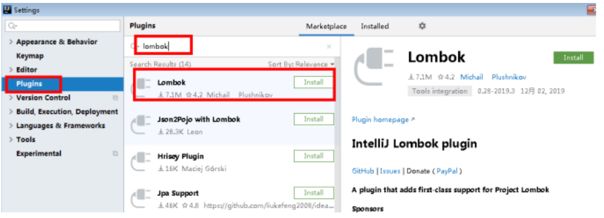
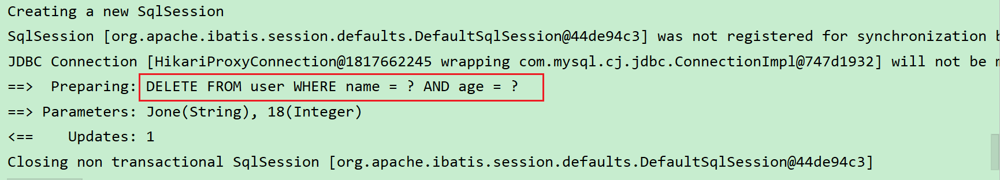
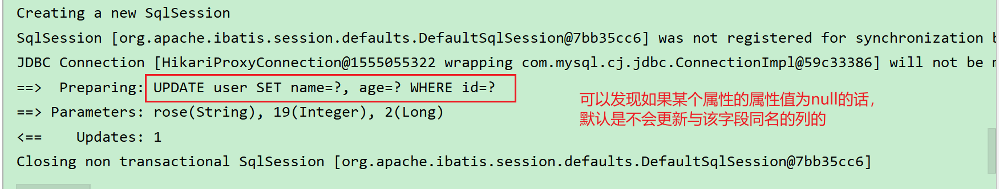
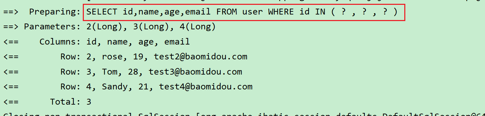
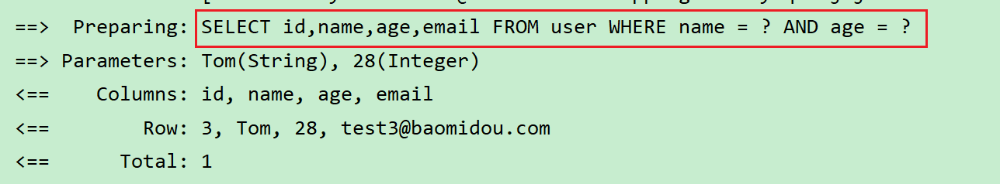
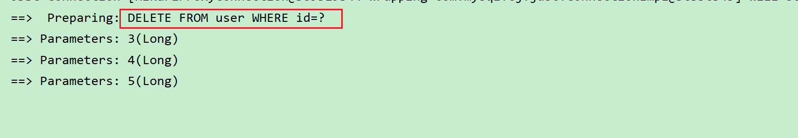
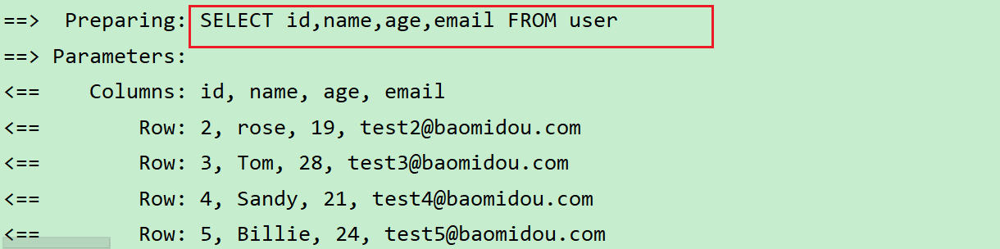
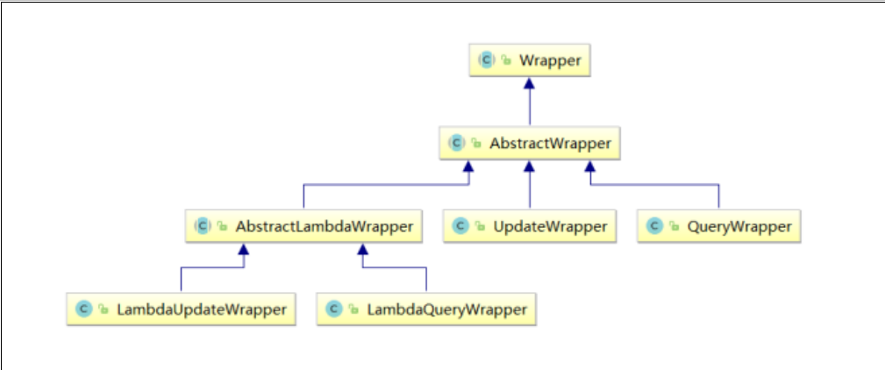
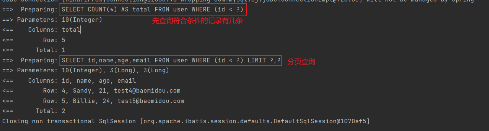
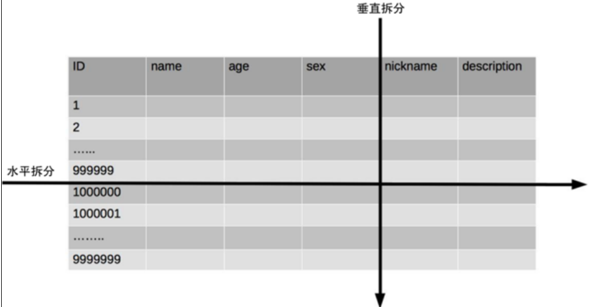

# 一. Mybatis Plus简介

## 1.概述

>  **MyBatis-Plus**（简称 MP）是一个 **MyBatis****的增强工具**，在 MyBatis 的基础上**只做增强不做改变**，为
>
>  **简化开发、提高效率而生**。


## 2.特性

>  **无侵入**：只做增强不做改变，引入它不会对现有工程产生影响，如丝般顺滑
>
>  **损耗小**：启动即会自动注入基本 CURD，性能基本无损耗，直接面向对象操作
>
>  **强大的** **CRUD** **操作**：内置通用 Mapper、通用 Service，仅仅通过少量配置即可实现单表大部分
>
>  CRUD 操作，更有强大的条件构造器，满足各类使用需求
>
>  **支持** **Lambda** **形式调用**：通过 Lambda 表达式，方便的编写各类查询条件，无需再担心字段写错
>
>  **支持主键自动生成**：支持多达 4 种主键策略（内含分布式唯一 ID 生成器 - Sequence），可自由
>
>  配置，完美解决主键问题
>
>  **支持** **ActiveRecord** **模式**：支持 ActiveRecord 形式调用，实体类只需继承 Model 类即可进行强
>
>  大的 CRUD 操作
>
>  **支持自定义全局通用操作**：支持全局通用方法注入（ Write once, use anywhere ）
>
>  **内置代码生成器**：采用代码或者 Maven 插件可快速生成 Mapper 、 Model 、 Service 、
>
>  Controller 层代码，支持模板引擎，更有超多自定义配置等您来使用
>
>  **内置分页插件**：基于 MyBatis 物理分页，开发者无需关心具体操作，配置好插件之后，写分页等
>
>  同于普通 List 查询
>
>  **分页插件支持多种数据库**：支持 MySQL、MariaDB、Oracle、DB2、H2、HSQL、SQLite、
>
>  Postgre、SQLServer 等多种数据库
>
>  **内置性能分析插件**：可输出 SQL 语句以及其执行时间，建议开发测试时启用该功能，能快速揪出
>
>  慢查询
>
>  **内置全局拦截插件**：提供全表 delete 、 update 操作智能分析阻断，也可自定义拦截规则，预防
>
>  误操作


# 二.使用

## 1.创建数据库

### 1.1创建数据库

>  ```mysql
>  create database mybatis_plus;
>  ```


### 1.2创建表

>  ```mysql
>  CREATE TABLE `user` (
>  `id` bigint(20) NOT NULL COMMENT '主键ID',
>  `name` varchar(30) DEFAULT NULL COMMENT '姓名',
>  `age` int(11) DEFAULT NULL COMMENT '年龄',
>  `email` varchar(50) DEFAULT NULL COMMENT '邮箱',
>  PRIMARY KEY (`id`)
>  ) ENGINE=InnoDB DEFAULT CHARSET=utf8;
>  ```


### 1.3插入数据

>  ```mysql
>  INSERT INTO user (id, name, age, email) VALUES
>  (1, 'Jone', 18, 'test1@baomidou.com'),
>  (2, 'Jack', 20, 'test2@baomidou.com'),
>  (3, 'Tom', 28, 'test3@baomidou.com'),
>  (4, 'Sandy', 21, 'test4@baomidou.com'),
>  (5, 'Billie', 24, 'test5@baomidou.com');
>  ```


## 2.创建SpringBoot工程

### 2.1创建工程


### 2.2引入依赖

>  ```xml
>  <dependency>
>      <groupId>org.springframework.boot</groupId>
>      <artifactId>spring-boot-starter</artifactId>
>  </dependency>
>  
>  <dependency>
>      <groupId>org.springframework.boot</groupId>
>      <artifactId>spring-boot-starter-test</artifactId>
>      <scope>test</scope>
>  </dependency>
>  
>  <dependency>
>      <groupId>com.baomidou</groupId>
>      <artifactId>mybatis-plus-boot-starter</artifactId>
>      <version>3.5.1</version>
>  </dependency>
>  
>  <dependency>
>      <groupId>org.projectlombok</groupId>
>      <artifactId>lombok</artifactId>
>      <optional>true</optional>
>  </dependency>
>  
>  <dependency>
>      <groupId>mysql</groupId>
>      <artifactId>mysql-connector-java</artifactId>
>      <scope>runtime</scope>
>  </dependency>
>  ```


### 2.3 idea安装lombok插件

>  


## 3.编写代码

### 3.1 springboot配置文件

>  ```properties
>  spring.application.name=mybatis-plus
>  
>  spring.datasource.driver-class-name=com.mysql.cj.jdbc.Driver
>  spring.datasource.url=jdbc:mysql://localhost:3306/mybatis_plus?serverTimezone=GMT%2B8&characterEncoding=utf-8&useSSL=false
>  spring.datasource.username=root
>  spring.datasource.password=lwb
>  
>  # 配置数据源的类型
>  spring.datasource.type=com.zaxxer.hikari.HikariDataSource
>  
>  # 关闭日志
>  logging.level.root=off
>  logging.level.org.springframework=off
>  
>  # mybatis相关日志
>  mybatis-plus.configuration.log-impl=org.apache.ibatis.logging.stdout.StdOutImpl
>  ```

*  注意

   >  1、驱动类driver-class-name
   >
   >  **spring boot 2.0（内置jdbc5驱动）**，驱动类使用：
   >
   >  `driver-class-name: com.mysql.jdbc.Driver`
   >
   >  **spring boot 2.1及以上（内置jdbc8驱动）**，驱动类使用：
   >
   >  `driver-class-name: com.mysql.cj.jdbc.Driver`
   >
   >  
   >
   >  2、连接地址url
   >
   >  **MySQL5.7**版本的url：
   >
   >  `jdbc:mysql://localhost:3306/mybatis_plus?characterEncoding=utf-8&useSSL=false`
   >
   >  **MySQL8.0**版本的url：
   >
   >  `jdbc:mysql://localhost:3306/mybatis_plus?`
   >
   >  `serverTimezone=GMT%2B8&characterEncoding=utf-8&useSSL=false`
   >
   >  否则运行测试用例报告如下错误：
   >
   >  `java.sql.SQLException: The server time zone value 'Öйú±ê׼ʱ¼ä' is unrecognized or`
   >
   >  `represents more`


### 3.2添加实体类

>  ```java
>  @Data
>  public class User {
>      private Long id;
>      private String name;
>      private Integer age;
>      private String email;
>  }
>  ```


### 3.3 编写mapper接口

>  ```java
>  public interface UserMapper extends BaseMapper<User> {
>  }
>  ```


### 3.4 springboot启动程序

>  ```java
>  @SpringBootApplication
>  @MapperScan("com.mybatisplus.mapper") // 扫描mapper接口所在包
>  public class SpringBootApplicationStart {
>      public static void main(String[] args) {
>          SpringApplication.run(SpringBootApplicationStart.class, args);
>      }
>  }
>  ```


### 3.5编写测试类

>  ```java
>  import org.junit.jupiter.api.Test;
>  
>  @SpringBootTest
>  public class MybatisPlusTest {
>  
>      @Autowired
>      private UserMapper userMapper;
>  
>      @Test // 这个test注解和spring的test注解要注意区分
>      public void start(){
>          List<User> users = userMapper.selectList(null);
>          System.out.println(users);
>      }
>  }
>  ```


# 三. BaseMapper

## 1.概述

>  **MyBatis-Plus中的基本CRUD在内置的BaseMapper中都已得到了实现，我们可以直接使用**，接口如下：
>
>  ```java
>  package com.baomidou.mybatisplus.core.mapper;
>  
>  public interface BaseMapper<T> extends Mapper<T> {
>      int insert(T entity);
>  
>      int deleteById(Serializable id);
>  
>      int deleteById(T entity);
>  
>      int deleteByMap(@Param("cm") Map<String, Object> columnMap);
>  
>      int delete(@Param("ew") Wrapper<T> queryWrapper);
>  
>      int deleteBatchIds(@Param("coll") Collection<?> idList);
>  
>      int updateById(@Param("et") T entity);
>  
>      int update(@Param("et") T entity, @Param("ew") Wrapper<T> updateWrapper);
>  
>      T selectById(Serializable id);
>  
>      List<T> selectBatchIds(
>          @Param("coll") Collection<? extends Serializable> idList);
>  
>      List<T> selectByMap(@Param("cm") Map<String, Object> columnMap);
>  
>      default T selectOne(@Param("ew") Wrapper<T> queryWrapper) {
>          List<T> ts = this.selectList(queryWrapper);
>          if (CollectionUtils.isNotEmpty(ts)) {
>              if (ts.size() != 1) {
>                  throw ExceptionUtils
>                      .mpe("One record is " 
>                           + "expected, but the query result is multiple records", 
>                           new Object[0]);
>              } else {
>                  return ts.get(0);
>              }
>          } else {
>              return null;
>          }
>      }
>  
>      default boolean exists(Wrapper<T> queryWrapper) {
>          Long count = this.selectCount(queryWrapper);
>          return null != count && count > 0L;
>      }
>  
>      Long selectCount(@Param("ew") Wrapper<T> queryWrapper);
>  
>      List<T> selectList(@Param("ew") Wrapper<T> queryWrapper);
>  
>      List<Map<String, Object>> selectMaps(@Param("ew") Wrapper<T> queryWrapper);
>  
>      List<Object> selectObjs(@Param("ew") Wrapper<T> queryWrapper);
>  
>      <P extends IPage<T>> P selectPage(P page, @Param("ew") Wrapper<T> queryWrapper);
>  
>      <P extends IPage<Map<String, Object>>> P selectMapsPage(P page, @Param("ew") Wrapper<T> queryWrapper);
>  }
>  ```


## 2.插入


## 3.删除

### 3.1通过id删除（传入id）

>  ```java
>  // deleteById(Serializable id)
>  @SpringBootTest
>  public class MybatisPlusTest {
>  
>      @Autowired
>      private UserMapper userMapper;
>  
>      @Test
>      public void testDelete(){
>          int i = userMapper.deleteById(1);
>      }
>  }
>  ```


### 3.2通过id删除（传入对象）

>  ```java
>  // deleteById(T entity)
>  @SpringBootTest
>  public class MybatisPlusTest {
>  
>      @Autowired
>      private UserMapper userMapper;
>  
>      @Test
>      public void testDelete(){
>          User user = new User();
>          user.setId((long) 2);
>          int i = userMapper.deleteById(user);
>      }
>  }
>  ```


### 3.3批量删除(单条sql实现)

>  ```java
>  // deleteBatchIds( @Param("coll") Collection<?> idList )
>  @SpringBootTest
>  public class MybatisPlusTest {
>  
>      @Autowired
>      private UserMapper userMapper;
>  
>      @Test
>      public void testDelete(){
>          List<Integer> list = Arrays.asList(3, 4, 5);
>          int i = userMapper.deleteBatchIds(list);
>      }
>  }
>  ```


### 3.4多条件删除

>  ```java
>  // deleteByMap( @Param("cm") Map<String, Object> columnMap )
>  @SpringBootTest
>  public class MybatisPlusTest {
>  
>      @Autowired
>      private UserMapper userMapper;
>  
>      @Test
>      public void testDelete(){
>          Map<String,Object> map = new HashMap<>();
>          map.put("name","Jone");
>          map.put("age",18);
>          int i = userMapper.deleteByMap(map);
>      }
>  }
>  ```
>
>  


## 4.修改

>  ```java
>  // updateById( @Param("et") T entity )
>  
>  @SpringBootTest
>  public class MybatisPlusTest {
>  
>      @Autowired
>      private UserMapper userMapper;
>  
>      @Test
>      public void testUpdate(){
>          User user = new User();
>          user.setId(2L);
>          user.setName("rose");
>          user.setAge(19);
>          userMapper.updateById(user);
>      }
>  }
>  ```
>
>  


## 5.查询

### 5.1根据id查询

>  ```java
>  // selectById( Serializable id )
>  @SpringBootTest
>  public class MybatisPlusTest {
>  
>      @Autowired
>      private UserMapper userMapper;
>  
>      @Test
>      public void testSelect(){
>          User user = userMapper.selectById(2);
>          System.out.println(user);
>      }
>  }
>  ```

### 5.2根据多个id查询（单条sql）

>  ```java
>  // selectBatchIds( @Param("coll") Collection<? extends Serializable> idList )
>  @SpringBootTest
>  public class MybatisPlusTest {
>  
>      @Autowired
>      private UserMapper userMapper;
>  
>      @Test
>      public void testSelect(){
>          List<Long> longs = Arrays.asList(2L, 3L, 4L);
>          List<User> users = userMapper.selectBatchIds(longs);
>          System.out.println(users);
>      }
>  }
>  ```
>
>  


### 5.3多条件查询

>  ```java
>  // selectByMap( @Param("cm") Map<String, Object> columnMap )
>  @SpringBootTest
>  public class MybatisPlusTest {
>  
>      @Autowired
>      private UserMapper userMapper;
>  
>      @Test
>      public void testSelect(){
>          Map<String,Object> map = new HashMap<>();
>          map.put("name","Tom");
>          map.put("age",28);
>          List<User> users = userMapper.selectByMap(map);
>          System.out.println(users);
>      }
>  }
>  ```
>
>  


### 5.4查询表中所有数据

>  ```java
>  // selectList( @Param("ew") Wrapper<T> queryWrapper )
>  @SpringBootTest
>  public class MybatisPlusTest {
>  
>      @Autowired
>      private UserMapper userMapper;
>  
>      @Test
>      public void testSelect(){
>          List<User> users = userMapper.selectList(null);
>          System.out.println(users);
>      }
>  }
>  ```


## 6. mapper接口继承BaseMapper

>  ```java
>  // 继承了BaseMapper，我们可以不用写基本的crud方法了，但是涉及到复杂的sql查询，可能需要我们编写相应的方法，以及mapper映射文件（比如多表查询）
>  public interface UserMapper extends BaseMapper<User> {
>  }
>  ```
>
>  

# 四. 通用的Service

## 1.概述

>  Mybatis-Plus提供了 **`IService`** 接口与其实现类 **`ServiceImpl`**，封装了常见的业务层逻辑。


## 2.使用mybatis-plus提供的service

1.  Service接口继承IService

    >  ```java
    >  public interface IUserService extends IService<User> {
    >  }
    >  ```

2.  Service接口实现类继承ServiceImpl并实现Service接口

    >  ```java
    >  @Service
    >  public class IUserServiceImpl extends ServiceImpl<UserMapper, User> 
    >      implements IUserService {
    >  }
    >  /* ServiceImpl的两个泛型参数解析：
    >  	UserMapper	继承了BaseMapper的mapper接口
    >  	User	就是与数据库表对应的实体类
    >  ```


## 3.插入

### 3.1批量插入

>  **因为SQL的长度有限制，大量数据插入无法使用单条SQL实现，因此MP将批量插入放在了通用Service中实现，而不是通用Mapper**

>  ```java
>  // saveBatch( Collection<T> entityList, int batchSize )
>  // batchSize 	批量插入的最大数
>  @SpringBootTest
>  public class IServiceTest {
>  
>      @Autowired
>      private IUserService userService;
>  
>      @Test
>      public void insert(){
>          User user = new User();
>          user.setId(6L);
>          user.setName("lwb");
>          user.setAge(22);
>          user.setEmail("12334@qq.com");
>          boolean b = userService.saveBatch(Arrays.asList(user),1000);
>      }
>  }
>  ```


## 4.删除

### 4.1通过id删除（传入id）

>  ```java
>  // removeById()
>  @SpringBootTest
>  public class IServiceTest {
>  
>      @Autowired
>      private IUserService userService;
>  
>      @Test
>      public void delete(){
>          boolean b = userService.removeById(1L);
>      }
>  }
>  ```


### 4.2通过id删除（传入对象）

>  ```java
>  // removeById()
>  @SpringBootTest
>  public class IServiceTest {
>  
>      @Autowired
>      private IUserService userService;
>  
>      @Test
>      public void delete(){
>          User user = new User();
>          user.setId(1L);
>          boolean b = userService.removeById(user);
>      }
>  }
>  ```


### 4.3批量删除（单条sql实现）

>  ```java
>  // removeByIds()
>  @SpringBootTest
>  public class IServiceTest {
>  
>      @Autowired
>      private IUserService userService;
>  
>      @Test
>      public void delete(){
>          List<Long> longs = Arrays.asList(1L, 2L);
>          boolean b = userService.removeByIds(longs);
>      }
>  }
>  ```


### 4.4批量删除（多条sql）

>  ```java
>  // removeBatchByIds()
>  @SpringBootTest
>  public class IServiceTest {
>  
>      @Autowired
>      private IUserService userService;
>  
>      @Test
>      public void delete(){
>          List<Long> longs = Arrays.asList(1L, 2L);
>          boolean b = userService.removeBatchByIds(longs);
>      }
>  }
>  ```
>
>  
>
>  该sql没有使用 **`in`** ，所以使用了多条sql去实现。


### 4.5多条件删除

>  ```java
>  // removeByMap()
>  ```


## 5.更新

### 5.1根据id更新

>  ```java
>  // updateById()
>  @SpringBootTest
>  public class IServiceTest {
>  
>      @Autowired
>      private IUserService userService;
>  
>      @Test
>      public void update(){
>          User user = new User();
>          user.setId(6L);
>          user.setName("lwb");
>          user.setAge(22);
>          user.setEmail("12334@qq.com");
>          userService.updateById(user);
>      }
>  }
>  ```


### 5.2批量更新（多条sql）

>  ```java
>  // updateBatchById( Collection<T> entityList, int batchSize )
>  @SpringBootTest
>  public class IServiceTest {
>  
>      @Autowired
>      private IUserService userService;
>  
>      @Test
>      public void update(){
>          User user = new User();
>          user.setId(6L);
>          user.setName("lwb");
>          user.setAge(22);
>          user.setEmail("12334@qq.com");
>          userService.updateBatchById(Arrays.asList(user), 1000);
>      }
>  }
>  ```


## 6.查询

### 6.1查询所有

>  ```java
>  @SpringBootTest
>  public class IServiceTest {
>  
>      @Autowired
>      private IUserService userService;
>  
>      @Test
>      public void select(){
>          List<User> list = userService.list();
>      }
>  }
>  ```
>
>  


### 6.2根据id查询

>  ```java
>  // getById()
>  @SpringBootTest
>  public class IServiceTest {
>  
>      @Autowired
>      private IUserService userService;
>  
>      @Test
>      public void select(){
>          User byId = userService.getById(6L);
>          System.out.println(byId);
>      }
>  }
>  ```


### 6.3根据多个id查询

>  ```java
>  // listByIds()
>  @SpringBootTest
>  public class IServiceTest {
>  
>      @Autowired
>      private IUserService userService;
>  
>      @Test
>      public void select(){
>          List<Long> longs = Arrays.asList(6L);
>          userService.listByIds(longs);
>      }
>  }
>  ```


### 6.4多条件查询

>  ```java
>  // listByMap()
>  @SpringBootTest
>  public class IServiceTest {
>  
>      @Autowired
>      private IUserService userService;
>  
>      @Test
>      public void select(){
>          Map<String,Object> map = new HashMap<>();
>          map.put("name","Tom");
>          map.put("age",28);
>          List<User> users = userService.listByMap(map);
>      }
>  }
>  ```


## 7.统计查询结果条数

>  ```java
>  // count()
>  @SpringBootTest
>  public class IServiceTest {
>  
>      @Autowired
>      private IUserService userService;
>      
>      @Test
>      public void count(){
>          userService.count();
>      }
>  }
>  ```


# 五.常用注解

## 1. @TableName

>  **该注解用于将实体类与数据库中的表绑定**
>
>  ```java
>  @Data
>  @TableName("user")
>  public class User {
>      private Long id;
>      private String name;
>      private Integer age;
>      private String email;
>  }
>  ```


## 2. @TableId

>  **MyBatis-Plus在实现CRUD时，会默认将id（类的字段名）作为主键列，并在插入数据时，默认基于雪花算法的策略生成id**。
>
>  若是类中的字段与表中的主键名相同，可以不用为@TableId中的value赋值。
>
>  若是类中的字段与表中的主键名不相同，则需要为其绑定表的主键
>
>  ```java
>  @Data
>  @TableName("user")
>  public class User {
>      @TableId("id")
>      private Long id;
>      
>      private String name;
>      private Integer age;
>      private String email;
>  }
>  ```


### 2.1 @TableId的type

>  **type属性用来定义主键策略**（主键策略是指Mybatis-plus可以自动生成主键的值的策略，不需要手动插入主键，Mybatis-plus的主键策略帮我们自动生成主键）
>
>  | type的值                 | 作用                                                         |
>  | ------------------------ | ------------------------------------------------------------ |
>  | IdType.ASSIGN_ID（默认） | 基于[雪花算法](##1.雪花算法)的策略生成数据id，与数据库id是否设置自增无关 |
>  | IdType.AUTO              | 使用数据库的自增策略，注意，该类型请确保数据库设置了id自增，否则无效 |
>  | IdType.ASSIGN_UUID       |                                                              |
>  | IdType.INPUT             |                                                              |
>  | IdType.NONE              |                                                              |


## 3. @TableField

>  MyBatis-Plus在执行SQL语句时，要保证实体类中的属性名和表中的字段名一致。
>
>  ```java
>  @Data
>  @TableName("user")
>  public class User {
>      @TableId(value = "id", type = IdType.ASSIGN_ID)
>      private Long id;
>  
>      @TableField("name")
>      private String name;
>      
>      @TableField("age")
>      private Integer age;
>      
>      @TableField("email")
>      private String email;
>  }
>  ```


## 4. @TableLogic

>  **绑定用于表示逻辑删除的列**
>
>  ```java
>  @Data
>  @TableName("user")
>  public class User {
>  	// ..
>      
>      @TableLogic("is_deleted")
>      private Boolean isDeleted;
>  }
>  ```

*  **删除方式**

   >  **物理删除**：真实删除，将对应数据从数据库中删除，之后查询不到此条被删除的数据
   >
   >  **逻辑删除**：假删除，将对应数据中代表是否被删除字段的状态修改为“被删除状态”，之后在数据库
   >
   >  中仍旧能看到此条数据记录
   >
   >  **逻辑删除使用场景**：可以进行数据恢复

* **扩展**

   > 可以在数据表中添加一个类型为 **`tinyint`** 的字段来表示是否逻辑删除


# 六. 条件构造器 @

## 1. wrapper简介

>  
>
>  -  Wrapper ： 条件构造抽象类，最顶端父类
>
>     -  AbstractWrapper ： 用于查询条件封装，生成 sql 的 where 条件
>
>        *  QueryWrapper ： 查询条件封装
>  *  UpdateWrapper ： Update 条件封装
>        *  AbstractLambdaWrapper ： 使用Lambda 语法
>
>           *  LambdaQueryWrapper ：用于Lambda语法使用的查询Wrapper
>  *  LambdaUpdateWrapper ： Lambda 更新封装Wrapper

## 2. wrapper常见方法 **

> | 函数名        | 说明                            | 示例                                                         |
> | ------------- | ------------------------------- | ------------------------------------------------------------ |
> | eq()          | =                               | eq("name", "lwb")<br>name = 'lwb'                            |
> | ne()          | !=                              | ne("name", "lwb")<br>name != 'lwb'                           |
> | gt()          | >                               | gt("age", 18)<br>age > 18                                    |
> | ge()          | >=                              | ge("age", 18)<br>age >= 18                                   |
> | lt()          | <                               | lt("age", 18)<br>age < 18                                    |
> | le()          | <=                              | le("age", 18)<br>age <= 18                                   |
> | between()     | BETWEEN v1 AND v2               | between("age", 18, 25)<br>age between 18 and 25              |
> | notBetween()  | NOT BETWEEN v1 AND v2           |                                                              |
> | like()        | LIKE '%key%'                    | like("name", "w")<br>like '%w%'                              |
> | notLike()     | NOT LIKE '%key%'                |                                                              |
> | likeLeft()    | LIKE '%key'                     | likeLeft("name", "w")<br>like '%w'                           |
> | likeRight()   | LIKE 'key%'                     | likeRight("name", "w")<br>like 'w%'                          |
> | isNull()      | field IS NULL                   | isNull("name")<br>name is null                               |
> | isNotNull()   | field IS NOT NULL               |                                                              |
> | in()          | field IN (v1, v2, ...)          | in("age", 18, 19, 20)<br>age in (18,19,20)                   |
> | notIn()       | field NOT IN (v1, v2, ...)      |                                                              |
> | inSql()       | field IN (sql 语句)             | inSql("id", "select id from user")<br>id in (select id from user) |
> | notInSql()    | field not IN (sql语句)          |                                                              |
> | groupBy()     | GROUP BY field1,...             | groupBy("id")<br>group by id                                 |
> | having()      | HAVING (sql 语句)               | having("sum(age) > {0}", 10)<br>having sum(age) > 10         |
> | orderByAsc()  | ORDER BY field1... ASC          |                                                              |
> | orderByDesc() | ORDER BY field1... DESC         |                                                              |
> | orderBy()     | ORDER BY field1...              |                                                              |
> | or()          | 拼接 OR                         | :one:or(i -> i.eq("name", "lwb").eq("age",18))<br>or (name='lwb' and age=18)<br>:two:or().eq("name", "lwb").eq("age", 19)<br>or name='lwb' and age=19 |
> | and()         | 拼接 AND                        | 与or类似                                                     |
> | apply()       | 拼接sql                         |                                                              |
> | last()        | 无视优化规则直接拼接到sql的最后 | 只能调用一次，多次调用以最后一次调用为准<br>last("limit 10")，限制查询结果条数为10 |
> | exists()      | exists(sql语句)                 |                                                              |
> | notExists()   | not exists(sql 语句)            |                                                              |
> | nested()      |                                 |                                                              |
>
> 


## 3. QueryWrapper


## 4. UpdateWrapper


## 5.LambdaQueryWrapper **


## 6.LambdaUpdateWrapper **


# 七.分页

## 1.配置mybatisplus自带的分页插件

### 1.1编写配置类

> ```java
> @Configuration
> public class MybatisPlusConfig {
> 
>     @Bean
>     public MybatisPlusInterceptor mybatisPlusInterceptor(){
>         MybatisPlusInterceptor interceptor = new MybatisPlusInterceptor();
>         
>         PaginationInnerInterceptor paginationInnerInterceptor = 
>             new PaginationInnerInterceptor(DbType.MYSQL);
>         
>         interceptor.addInnerInterceptor(paginationInnerInterceptor);
>         return interceptor;
>     }
> }
> ```

### 1.2测试

> ```java
> @SpringBootTest
> public class PageTest {
> 
>     @Autowired
>     private IUserService userService;
> 
>     @Test
>     public void pageTest(){
>         LambdaQueryWrapper<User> wrapper = Wrappers.lambdaQuery(User.class);
>         wrapper.lt(User::getId, 10);
>         
>         IPage<User> iPage = new Page<>(1,3);
>         IPage<User> page = userService.page(iPage, wrapper);
>         List<User> records = page.getRecords(); // 获得查询结果集
>         long total = page.getTotal(); // 获得数据库中记录总数
>     }
> }
> ```
>
> 


## 2.自定义mapper方法实现分页

> 有时候BaseMapper提供的方法可能不能满足我们的需求，我们要自己编写mapper方法，且要用到分页功能

### 2.1编写mapper方法

> ```java
> public interface UserMapper extends BaseMapper<User> {
>     IPage<User> selectByPage(@Param("page") IPage iPage, @Param("id") Integer id);
> }
> ```

### 2.2编写mapper映射问价

> ```xml
> <?xml version="1.0" encoding="UTF-8"?>
> <!DOCTYPE mapper PUBLIC "-//mybatis.org//DTD Mapper 3.0//EN" "http://mybatis.org/dtd/mybatis-3-mapper.dtd">
> <mapper namespace="com.mybatisplus.mapper.UserMapper">
> 
>     <select id="selectByPage" resultType="com.mybatisplus.entity.User">
>         select `id`,`name`,`age`,`email` from `user` where id &lt; #{id}
>     </select>
> </mapper>
> <!-- 由于 < 会被解析为标签，所以我们要使用转义符 &lt; -->
> ```

### 2.3 springboot配置文件配置mapper文件的location

> ```properties
> mybatis-plus.mapper-locations=classpath*:mybatis/mapper/*.xml
> 
> # 注意：配置了MybatisPlusConfig配置类就不要写下面的，两者只能存在一个
> # mybatis-plus.config-location=classpath:mybatis/mybatis-config.xml
> ```


### 2.4测试

> ```java
> @SpringBootTest
> public class PageTest {
> 
>     @Autowired
>     private UserMapper userMapper;
> 
>     @Test
>     public void selfDefineMethodUsePage(){
>         IPage<User> iPage = new Page<>(2,3);
>         IPage<User> page = userMapper.selectByPage(iPage, 10);
>         List<User> records = page.getRecords();
>     }
> }
> ```


# 八.乐观锁


# 九.通用枚举


# 十. 代码生成器


# 十一. 多数据源


# 十二. MybatisX插件


# 十三. 扩展

## 1.雪花算法

### 1.1背景

>  需要选择合适的方案去应对数据规模的增长，以应对逐渐增长的访问压力和数据量。
>
>  数据库的扩展方式主要包括：**业务分库**、**主从复制**，**数据库分表**。

### 1.2数据库分表

>  将不同业务数据分散存储到不同的数据库服务器，能够支撑百万甚至千万用户规模的业务，但如果业务继续发展，同一业务的单表数据也会达到单台数据库服务器的处理瓶颈。例如，淘宝的几亿用户数据，如果全部存放在一台数据库服务器的一张表中，肯定是无法满足性能要求的，此时就需要对单表数据进行拆分。
>
>  单表数据拆分有两种方式：垂直分表和水平分表。示意图如下：
>
>  


#### 1.2.1垂直分表

>  **垂直分表适合将表中某些不常用且占了大量空间的列拆分出去**。
>
>  例如，前面示意图中的 nickname 和 description 字段，假设我们是一个婚恋网站，用户在筛选其他用户的时候，主要是用 age 和 sex 两个字段进行查询，而 nickname 和 description 两个字段主要用于展示，一般不会在业务查询中用到。description 本身又比较长，因此我们可以将这两个字段独立到另外一张表中，这样在查询 age 和 sex 时，就能带来一定的性能提升。


#### 1.2.2水平分表

##### 1.概述

>  水平分表适合表行数特别大的表，有的公司要求单表行数超过 5000 万就必须进行分表，这个数字可以作为参考，但并不是绝对标准，关键还是要看表的访问性能。对于一些比较复杂的表，可能超过 1000万就要分表了；而对于一些简单的表，即使存储数据超过 1 亿行，也可以不分表。但不管怎样，当看到表的数据量达到千万级别时，作为架构师就要警觉起来，因为这很可能是架构的性能瓶颈或者隐患。
>
>  水平分表相比垂直分表，会引入更多的复杂性，例如要求全局唯一的数据id该如何处理。


##### 2.自增主键

>  以最常见的用户 ID 为例，可以按照 1000000 的范围大小进行分段，1 ~ 999999 放到表 1中，1000000 ~ 1999999 放到表2中，以此类推。
>
>  复杂点：分段大小的选取。分段太小会导致切分后子表数量过多，增加维护复杂度；分段太大可能会导致单表依然存在性能问题，一般建议分段大小在 100 万至 2000 万之间，具体需要根据业务选取合适的分段大小。
>
>  优点：可以随着数据的增加平滑地扩充新的表。例如，现在的用户是 100 万，如果增加到 1000 万，只需要增加新的表就可以了，原有的数据不需要动。
>
>  缺点：分布不均匀。假如按照 1000 万来进行分表，有可能某个分段实际存储的数据量只有 1 条，而另外一个分段实际存储的数据量有 1000 万条

##### 3.取模

>  同样以用户 ID 为例，假如我们一开始就规划了 10 个数据库表，可以简单地用 user_id % 10 的值来表示数据所属的数据库表编号，ID 为 985 的用户放到编号为 5 的子表中，ID 为 10086 的用户放到编号为 6 的子表中。
>
>  复杂点：初始表数量的确定。表数量太多维护比较麻烦，表数量太少又可能导致单表性能存在问题。
>
>  优点：表分布比较均匀。
>
>  缺点：扩充新的表很麻烦，所有数据都要重分布。


##### 3.雪花算法

>  雪花算法是由Twitter公布的分布式主键生成算法，它能够保证不同表的主键的不重复性，以及相同表的主键的有序性。
>
>  **核心思想**：
>
>  长度共64bit（一个long型）。首先是一个符号位，1bit标识，由于long基本类型在Java中是带符号的，最高位是符号位，正数是0，负数是1，所以id一般是正数，最高位是0。41bit时间截(毫秒级)，存储的是时间截的差值（当前时间截 - 开始时间截)，结果约等于69.73年。10bit作为机器的ID（5个bit是数据中心，5个bit的机器ID，可以部署在1024个节点）。12bit作为毫秒内的流水号（意味着每个节点在每毫秒可以产生 4096 个 ID）。
>
>  


*  **优点**

   >  整体上按照时间自增排序，并且整个分布式系统内不会产生ID碰撞，并且效率较高。


### 1.3雪花算法思想

>  雪花算法是由Twitter公布的分布式主键生成算法，它能够保证不同表的主键的不重复性，以及相同表的主键的有序性。
>
>  **核心思想**：
>
>  长度共64bit（一个long型）。首先是一个符号位，1bit标识，由于long基本类型在Java中是带符号的，最高位是符号位，正数是0，负数是1，所以id一般是正数，最高位是0。41bit时间截(毫秒级)，存储的是时间截的差值（当前时间截 - 开始时间截)，结果约等于69.73年。10bit作为机器的ID（5个bit是数据中心，5个bit的机器ID，可以部署在1024个节点）。12bit作为毫秒内的流水号（意味着每个节点在每毫秒可以产生 4096 个 ID）。
>
>  


*  **优点**

   >  整体上按照时间自增排序，并且整个分布式系统内不会产生ID碰撞，并且效率较高。


## 2. mybatis-plus配置

>  ```properties
>  # mybatis相关日志
>  mybatis-plus.configuration.log-impl=org.apache.ibatis.logging.stdout.StdOutImpl
>  
>  # 使用@TableName绑定表时，为其加上前缀
>  # 比如：@TableName("user")，则绑定的表示 t_user
>  mybatis-plus.global-config.db-config.table-prefix=t_
>  
>  # 配置Mybatis-Plus的主键策略(全局有效)
>  mybatis-plus.global-config.db-config.id-type=auto
>  
>  # 配置mapper文件所在位置
>  mybatis-plus.mapper-locations=classpath*:mybatis/mapper/*.xml
>  
>  # mybatis-plus配置所在位置
>  # 注意：配置了MybatisPlusConfig配置类就不要写下面的，两者只能存在一个
>  # mybatis-plus.config-location=classpath:mybatis/mybatis-config.xml
>  ```
>
>  

