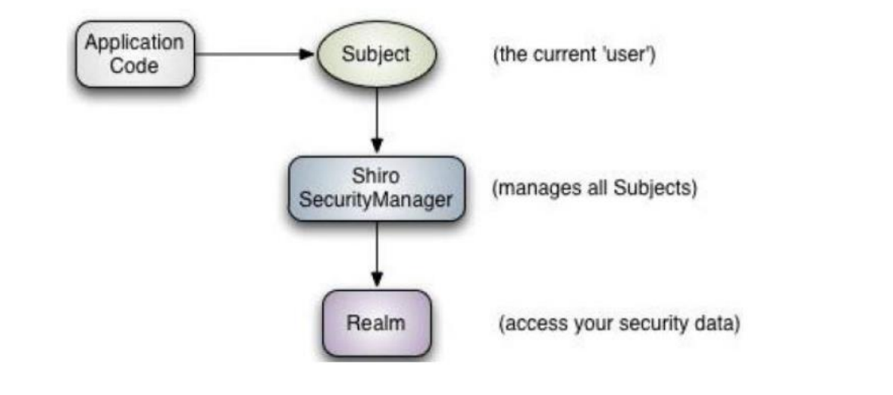

# 一.概述

## :one:什么是Shiro

>  Apache Shiro 是一个功能强大且易于使用的 Java 安全(权限)框架。Shiro 可以完成：**认证**、**授权**、**加密**、**会话管理**、**与 Web 集成**、**缓存** 等。借助 Shiro 您可以快速轻松地保护任何应用程序——从最小的移动应用程序到最大的 Web 和企业应用程序。
>
>  官网：https://shiro.apache.org/


## :two: Why Shiro

>  自 2003 年以来，框架格局发生了相当大的变化，因此今天仍然有很多系统在使用Shiro。这与 Shiro 的特性密不可分。
>
>  易于使用：使用 Shiro 构建系统安全框架非常简单。就算第一次接触也可以快速掌握。
>
>  全面：Shiro 包含系统安全框架需要的功能，满足安全需求的“一站式服务”。
>
>  灵活：Shiro 可以在任何应用程序环境中工作。虽然它可以在 Web、EJB 和 IoC 环境中工作，但不需要依赖它们。Shiro 也没有强制要求任何规范，甚至没有很多依赖项。
>
>  强力支持 Web：Shiro 具有出色的 Web 应用程序支持，可以基于应用程序 URL 和Web 协议（例如 REST）创建灵活的安全策略，同时还提供一组 JSP 库来控制页面输出。
>
>  兼容性强：Shiro 的设计模式使其易于与其他框架和应用程序集成。Shiro 与Spring、Grails、Wicket、Tapestry、Mule、Apache Camel、Vaadin 等框架无缝集成。
>
>  社区支持：Shiro 是 Apache 软件基金会的一个开源项目，有完备的社区支持，文档支持。如果需要，像 Katasoft 这样的商业公司也会提供专业的支持和服务


## :three:Shiro vs SpringSecurity

1.  Spring Security 基于 Spring 开发，项目若使用 Spring 作为基础，配合 Spring Security 做权限更加方便，而 Shiro 需要和 Spring 进行整合开发；

2.  Spring Security 功能比 Shiro 更加丰富些，例如安全维护方面；

3.  Spring Security 社区资源相对比 Shiro 更加丰富；

4.  Shiro 的配置和使用比较简单，Spring Security 上手复杂些；

5.  Shiro 依赖性低，不需要任何框架和容器，可以独立运行，而 Spring Security 依赖Spring 容器；

6.  Shiro 不仅仅可以使用在 web 中，它可以工作在任何应用环境中。在集群会话时 Shiro 最重要的一个好处或许就是它的会话是独立于容器的。


## :four:Shiro功能

1.  ==`Authentication`==，身份认证/登录，验证用户是不是拥有相应的身份
2.  ==`Authorization`==，授权，即权限验证，验证某个已 Authentication 的用户是否拥有某个权限
3.  ==`Session Manager`==，会话管理
4.  ==`Cryptography`==，加密，保护数据的安全性，如密码加密存储到数据库，而不是明文存储；
5.  ==`Web Support`==，Web 支持，可以非常容易的集成到 Web 环境；
6.  ==`Caching`==，缓存，比如用户登录后，其用户信息、拥有的角色/权限不必每次去查，这样可以提高效率；
7.  ==`Concurrency`==，Shiro支持多线程应用的并发验证，即在一个线程中开启另一个线程，能把权限自动传播过去；
8.  ==`Testing`==，提供测试支持
9.  ==`Run As`==，允许一个用户假装为另一个用户（如果他们允许）的身份进行访问；
10.  ==`Remember Me`==，记住我，这个是非常常见的功能，即一次登录后，下次再来的话不用登录了


## :five:Shiro架构概述

### 1.从应用程序角度看

>  
>
>  ==Subject==，应用代码直接交互的对象是 Subject，也就是说 Shiro 的对外 API 核心就是 Subject。Subject 代表了当前“用户”， 这个用户不一定 是一个具体的人，与当前应用交互的任何东西都是 Subject，如网络爬虫， 机器人等；与 Subject 的所有交互都会委托给 SecurityManager； Subject 其实是一个门面，SecurityManager 才是实际的执行者；
>
>  ==SecurityManager==：安全管理器；即所有与安全有关的操作都会与 SecurityManager 交互；且其管理着所有 Subject；可以看出它是 Shiro 的核心，它负责与 Shiro 的其他组件进行交互，它<u>**相当于 SpringMVC 中DispatcherServlet 的角色**</u>
>
>  ==Realm==：Shiro 从 Realm 获取安全数据（如用户、角色、权限），就是说 SecurityManager 要验证用户身份，那么它需要从 Realm 获取相应的用户 进行比较以确定用户身份是否合法；也需要从 Realm 得到用户相应的角色/ 权限进行验证用户是否能进行操作；**可以把 Realm 看成 DataSource**


### 2.从Shiro内部看

>  
>
>  ==Subject== ([`org.apache.shiro.subject.Subject`](https://shiro.apache.org/static/current/apidocs/org/apache/shiro/subject/Subject.html)) ，当前与软件交互的实体(用户，第三方服务，cron 作业等)的特定于安全性的“视图”。
>
>  ==SecurityManager==（[org.apache.shiro.mgt.SecurityManager](http://www.javashuo.com/link?url=http://shiro.apache.org/static/current/apidocs/org/apache/shiro/mgt/SecurityManager.html)），相当于 SpringMVC 中的 DispatcherServlet；是 Shiro 的心脏； 所有具体的交互都通过 SecurityManager 进行控制；它管理着所有 Subject、且负责进行 **认证**、**授权**、**会话**、**缓存**的管理。
>
>  ==Authenticator== ([org.apache.shiro.authc.Authenticator](https://shiro.apache.org/static/current/apidocs/org/apache/shiro/authc/Authenticator.html))，`Authenticator`是负责执行用户的身份验证(登录)并对其作出反应的组件。当用户尝试登录时，该逻辑由`Authenticator`执行。 `Authenticator`知道如何与一个或多个存储相关用户/帐户信息的`Realms`进行协调。从这些`Realms`获得的数据用于验证用户的身份，以确保用户确实是他们所说的真实身份。（**可以理解为SpringSecurity中查询数据库验证账号密码**）
>
>  *  **Authentication Strategy** ([org.apache.shiro.authc.pam.AuthenticationStrategy](https://shiro.apache.org/static/current/apidocs/org/apache/shiro/authc/pam/AuthenticationStrategy.html))，如果配置了多个`Realm`，则`AuthenticationStrategy`将协调 `Realm` 以确定身份验证尝试成功或失败的条件(例如，如果一个 `Realm` 成功但其他领域失败，则该尝试成功吗？是否所有领域都必须成功？第一？)。
>
>  ==Authorizer== ([org.apache.shiro.authz.Authorizer](https://shiro.apache.org/static/current/apidocs/org/apache/shiro/authz/Authorizer.html)) ，`Authorizer`是负责确定应用程序中用户访问控制的组件。它是最终表明是否允许用户做某事的机制。与`Authenticator`一样，`Authorizer`也知道如何与多个后端数据源进行协调以访问角色和权限信息。 `Authorizer`使用此信息来确定是否允许用户执行给定的动作。
>
>  ==SessionManager== ([org.apache.shiro.session.mgt.SessionManager](https://shiro.apache.org/static/current/apidocs/org/apache/shiro/session/mgt/SessionManager.html)) ，`SessionManager`知道如何创建和 Management 用户`Session`的生命周期，以便为所有环境中的用户提供可靠的会话体验。这是安全框架领域中的一项独特功能-Shiro 能够在任何环境中本地 Management 用户会话，即使没有 Web/Servlet 或 EJB 容器也可以。默认情况下，Shiro 将使用现有的会话机制(例如 Servlet 容器)(如果可用)，但是如果没有这种机制(例如在独立应用程序或非 Web 环境中)，它将使用其内置的企业会话 Management 来提供相同的编程经验。 `SessionDAO`的存在是为了允许使用任何数据源来保留会话（**因为web环境有sessionId，所以管理Session比较方便**）
>
>  *  **SessionDAO** ([org.apache.shiro.session.mgt.eis.SessionDAO](https://shiro.apache.org/static/current/apidocs/org/apache/shiro/session/mgt/eis/SessionDAO.html))，`SessionDAO`代表`SessionManager`执行`Session`持久性操作(CRUD)。这允许将任何数据存储插入会话 Management 基础结构。
>
>  ==CacheManager== ([org.apache.shiro.cache.CacheManager](https://shiro.apache.org/static/current/apidocs/org/apache/shiro/cache/CacheManager.html))，`CacheManager`创建和 Management 其他 Shiro 组件使用的`Cache`实例生命周期。由于 Shiro 可以访问许多后端数据源以进行身份验证，授权和会话 Management，因此缓存一直是框架中的一流架构功能，可以在使用这些数据源时提高性能。可以将任何现代的开源和/或企业缓存产品插入 Shiro，以提供快速有效的用户体验。（**<u>通俗理解：缓存控制器，来管理如用户、角色、权限等的缓存的；因为这些数据基本上很少改变，放到缓存中后可以提高访问的性能</u>**）
>
>  ==Cryptography== ([org.apache.shiro.crypto.*](https://shiro.apache.org/static/current/apidocs/org/apache/shiro/crypto/package-summary.html))，密码模块，Shiro 提高了一些常见的加密组件用于如密码加密/解密
>
>  ==Realms== ([org.apache.shiro.realm.Realm](https://shiro.apache.org/static/current/apidocs/org/apache/shiro/realm/Realm.html))，领域充当 Shiro 与应用程序安全数据之间的“bridge 梁”或“连接器”。当 需要与安全性相关的数据(例如用户帐户)进行交互以执行身份验证(登录)和授权(访问控制)时，Shiro 会从一个或多个为应用程序配置的领域中查找许多此类内容。您可以根据需要配置多个`Realms`(通常每个数据源一个)，并且 Shiro 会根据需要与它们进行协调，以进行身份验证和授权。（**<u>通俗理解：可以认为是安全实体数据源，即用于获取安全实体 的；可以是 JDBC 实现，也可以是内存实现等等；由用户提供；所以一般在应用中都需要 实现自己的 Realm</u>**）


# 二.使用

## :one:环境准备

>  **Shiro不依赖容器，直接创建maven工程即可** 

>  ```xml
>  <dependency>
>      <groupId>org.apache.shiro</groupId>
>      <artifactId>shiro-core</artifactId>
>      <version>1.9.0</version>
>  </dependency>
>  <dependency>
>      <groupId>commons-logging</groupId>
>      <artifactId>commons-logging</artifactId>
>      <version>1.2</version>
>  </dependency>
>  ```


## :two:INI文件

>  

>  ```ini
>  [users]
>  # username=password
>  lwb=123
>  ```

## :three:Authentication测试

### 1.测试代码

>  ```java
>  // 1. 创建 SecurityManger工厂（不推荐通过 ini 文件方式创建）
>  IniSecurityManagerFactory factory 
>      = new IniSecurityManagerFactory("classpath:shiro.ini");
>  // 2. 获得 SecurityManager 
>  SecurityManager instance = factory.getInstance();
>  // 3. 将 SecurityManager放入 SecurityUtils
>  SecurityUtils.setSecurityManager(instance);
>  // 4. 获得 Subject
>  Subject subject = SecurityUtils.getSubject();
>  // 5. 创建认证对象，收集 主体 和 证书（一般为用户名和密码）
>  AuthenticationToken token = new UsernamePasswordToken("lwb1", "123");
>  try{
>      // 6. 提交主体和凭据
>      subject.login(token);
>      System.out.println("login success");
>  }catch(UnknownAccountException e){
>      System.out.println("username doesn't exists");
>  }catch (IncorrectCredentialsException e){
>      System.out.println("wrong password");
>  }catch (AuthenticationException e){
>      e.printStackTrace();
>  }
>  ```
>
>  :warning::warning::warning: <u>尽管您的代码可以对特定的异常做出反应并在必要时执行逻辑，但是安全性最佳做法是仅在发生失败时向最终用户**显示通用失败消息**，例如“用户名或密码不正确”。这样可确保没有任何特定信息可供尝试攻击媒介的黑客使用。</u>


### 2.  Authentication概念

>  身份验证，一般需要提供如身份ID等一些标识信息来表明登录者的身份，如提供email，用户名/密码来证明。
>
>  在Shiro中，用户需要提供 principals（身份） 和 credentials（证明）给 shiro，从而验证用户身份。
>
>  一个主体可以有多个principals，但只有一个Primary principals，一般是用户名/邮箱/手机号。
>
>  最常见的 principals 和 credentials 组合就是用户名和密码


### 3. Authentication流程

>  （1）首先调用 Subject.login(token) 进行登录，其会自动委托给 SecurityManager 
>
>  （2）SecurityManager 负责真正的身份验证逻辑；它会委托给 Authenticator 进行身份验证；
>
>  （3）==Authenticator== 才是真正的身份验证者，Shiro API 中核心的身份认证入口点，此处可以自定义插入自己的实现；
>
>  （4）Authenticator 可能会委托给相应的 AuthenticationStrategy 进 行多 Realm 身份验证，默认 ModularRealmAuthenticator 会调用 AuthenticationStrategy 进行多 Realm 身份验证；
>
>  （5） Authenticator 会把相应的 token 传入 Realm，从 Realm 获取 身份验证信息，如果没有返回/抛出异常表示身份验证失败了。此处 可以配置多个Realm，将按照相应的顺序及策略进行访问


## :four:Subject常用方法

>  ```java
>  subject.getPrincipal()	// 获取主题的身份（如用户名）
>  ```
>
>  ```java
>  subject.isAuthenticated() // 判断该主体是否已经验证过了（如是否已经登录了）
>  ```
>
>  


